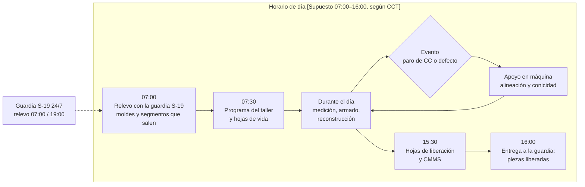
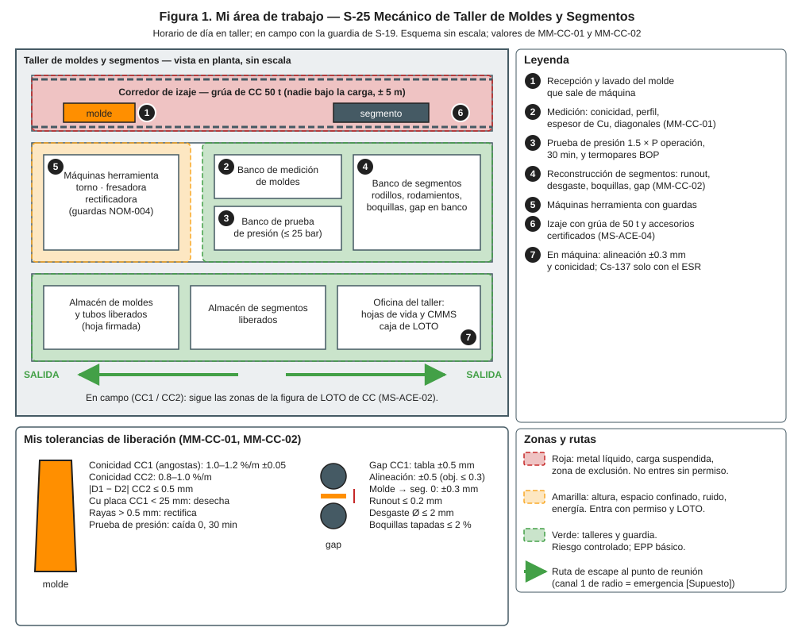
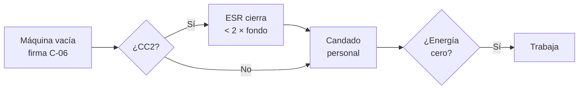
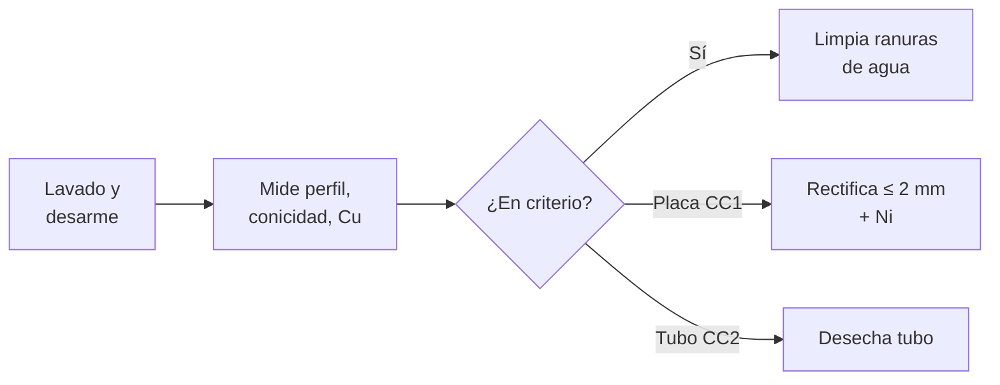
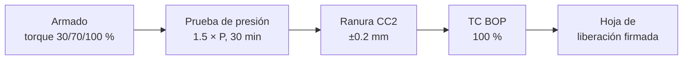
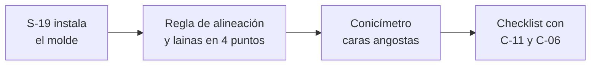
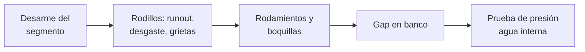
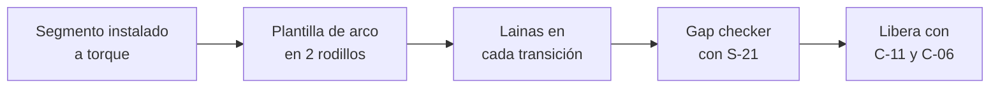

# IT-ACE-S25 — Instrucción de Trabajo: S-25 Mecánico de Taller de Moldes y Segmentos

## 1. Encabezado de control

| Campo | Valor |
|---|---|
| Código | IT-ACE-S25 |
| Versión | 0.1 |
| Estado | Borrador para validación |
| Rol | S-25 Mecánico de Taller de Moldes y Segmentos · sindicalizado — Técnico C (N-5) / B (N-6) / A (N-7) |
| Área | Mantenimiento de Acería: taller de moldes (placas CC1, tubos CC2) y de segmentos y guías; apoyo en máquina CC1 / CC2 |
| Turno | Horario de día (administrativo); el cambio en máquina lo apoya la guardia de S-19 (relevo 07:00 / 19:00) · jornada según el CCT [CCT: pedir texto] |
| Reporta a | C-11 Supervisor de Mantenimiento Mecánico |
| Manuales de referencia | MM-CC-01, MM-CC-02 · MS-ACE-02, -04, -05, -07, -10 · DP-ACE-S (S-25) |
| Elaboró | gerente-personal-sindicalizado (Líder de la Academia de Mantenimiento y Confiabilidad) |
| Revisión técnica | experto-operativo-metalurgia — visto bueno (con observaciones), 2026-09-26 |
| Revisión de seguridad | experto-seguridad-salud — visto bueno, 2026-09-26 |
| Revisión laboral | experto-relaciones-laborales — visto bueno (con observaciones), 2026-09-26 |
| Aprobó | Pendiente — Director |
| Fecha | 2026-09-25 |

> Esta IT resume tu trabajo; **no reemplaza al manual**. Espesores, torques y presiones de prueba son **[Validar con OEM]**. La conicidad y el gap por grado los fija C-08 en su tabla.

## 2. Mi puesto en 30 segundos
Entrego moldes y segmentos dentro de tolerancia para evitar breakouts y defectos del producto. En el taller mido, rectifico y armo moldes; reconstruyo segmentos y guías. En la máquina alineo el molde y los segmentos y mido conicidad y gap con la guardia. **El molde es la primera barrera contra el breakout:** no libero nada fuera de tolerancia. Sin funciones de mando (LFT art. 9): si algo no está bien, **aviso, detengo y escalo** a C-11.

> ★ **Mis 3 reglas de oro**
> 1. ★ **Nada sale del taller sin hoja firmada:** prueba de presión, conicidad, TC y torques.
> 2. ★ **Instrumento calibrado o no mido.** Conicímetro, perfilómetro, UT y gap checker con etiqueta vigente.
> 3. ★ **Nunca bajo la carga** del molde o del segmento; en CC2, la fuente la cierra solo el ESR.

## 3. Mi turno de 12 horas
No tengo guardia de 12 h: trabajo en horario de día. Me coordino con la guardia de S-19, que recibe y entrega a las 07:00 y 19:00.

- **Meta:** 100 % de moldes y segmentos listos a tiempo para paros programados (DP-ACE-S).

> **Mi jornada (nota laboral).** Mi turno está pactado en el CCT [CCT: pedir texto]. El relevo y la entrega–recepción antes de las 07:00 / 19:00 son tiempo de trabajo (LFT art. 58). Se cuentan en la jornada o se pagan según el CCT. La jornada de 12 h y la reforma de 40 h están en revisión (arts. 59–61 y 66–68) — verificar con Jurídico Laboral.

## 4. Mi área de trabajo

## 5. Mi EPP

| Pictograma | EPP | Cuándo lo uso |
|---|---|---|
| [CASCO] | Casco, lentes, botas metatarsales | Siempre en taller y en máquina |
| [CARETA] | Careta facial | Esmerilado y rectificado |
| [ANTICORTE] | Guantes anticorte | Manejo de placas, rodillos y lainas |
| [OÍDO] | Protección auditiva | Máquinas herramienta y rectificado |
| [FR] | Ropa FR y guantes para calor | En máquina caliente |
| [DOSÍMETRO] | Dosímetro personal | Cerca de la fuente de Cs-137 (CC2) |
| [ARNÉS] | Arnés con línea de vida | Plataformas de segmentos y colada con borde abierto |
| [GAS] | Detector de gases | Cámara de rociado (espacio confinado) |

## 6. Mis tareas paso a paso

### Tarea 1 — LOTO en la máquina de colada y fuente de Cs-137 (MS-ACE-02, MS-ACE-07)

| Paso | Qué hago | Cómo verifico (medición) | ★ |
|---|---|---|---|
| 1 | Confirma máquina vacía y barra falsa estacionada. | Entrega firmada por C-06. | ★ |
| 2 | En CC2, el ESR (C-16) cierra el obturador y pone su candado. | Radiámetro < 2 × fondo, anotado en el permiso. | ★ |
| 3 | Pon tu candado personal en la caja grupal. | Un candado por persona. | ★ |
| 4 | Verifica la prueba de energía cero del permiso. | Oscilación y rodillos rechazados; 0 bar; 0 V. | ★ |
| 5 | En taller: guardas puestas en torno, fresadora y rectificadora. | Guarda y paro de emergencia funcionan (NOM-004). | ★ |

> 🛑 **ALTO — detén y avisa si…**
> - Radiámetro ≥ 2 × fondo con obturador "cerrado": aléjate ≥ 3 m.
> - Alguien pide mover la barra falsa con personal en la cámara de rociado.

### Tarea 2 — Medición del molde en el taller (MM-CC-01) · lidero la ejecución (A)

| Paso | Qué hago | Cómo verifico (medición) | ★ |
|---|---|---|---|
| 1 | Lava y desarma el molde que sale de máquina. | Hoja de vida abierta (coladas, toneladas). | |
| 2 | Mide espesor de Cu de placas CC1 con UT calibrado. | ≥ 25 mm; < 25 mm desecha. | 🔎 |
| 3 | Mide rayas y estado del Ni. | Rayas ≤ 0.3 mm; > 0.5 mm rectifica; Ni desprendido > 20 mm² recubre. | 🔎 |
| 4 | Mide planitud de cara ancha. | ≤ 0.2 mm; > 0.3 mm rectifica. | 🔎 |
| 5 | Mide el tubo CC2 con perfilómetro cada 100 mm. | Lado 160.0 ±0.3 mm; \|D1 − D2\| ≤ 0.5 mm; esquinas ≤ 0.5 mm. | 🔎 |
| 6 | Mide la conicidad del tubo CC2. | 0.8–1.0 %/m; pérdida > 20 % del nominal = desecha. | 🔎 |
| 7 | Decide con C-11: reutilizar, rectificar (≤ 2 mm por intervención) o desechar. | Decisión en la hoja de vida. | ★ |

> 🛑 **ALTO — detén y avisa si…**
> - El instrumento no tiene calibración vigente.
> - Una placa rectificada queda con Cu < 25 mm: va a desecho.

### Tarea 3 — Armado, prueba de presión y liberación de taller (MM-CC-01) · A

| Paso | Qué hago | Cómo verifico (medición) | ★ |
|---|---|---|---|
| 1 | Aprieta espárragos placa–caja del centro hacia afuera, 3 pasadas. | 30 / 70 / 100 % del torque OEM (típ. 100–150 N·m [Validar]); ±5 %. | ★ |
| 2 | Haz la prueba de presión en el banco. | 1.5 × P de operación (típ. 15 bar [Validar]), 30 min: caída 0 y sin goteo. | ★ |
| 3 | En CC2, centra tubo y chaqueta con lainas en 4 lados y 3 alturas. | Ranura 4.0 mm [Validar] ±0.2 mm. | 🔎 |
| 4 | Ajusta la conicidad de CC1 según la tabla de C-08. | 1.0–1.2 %/m ±0.05; ancho ±1.0 mm. | 🔎 |
| 5 | Verifica los termopares BOP con pistola de calor (con S-21). | Todos leen; ±3 °C entre vecinos. | 🔎 |
| 6 | Llena y firma la hoja de liberación con C-11. | Prueba, conicidad, TC y torques anotados. | ★ |

> 🛑 **ALTO — detén y avisa si…**
> - La prueba de presión cae: rehaz juntas y repite. **No se libera.**
> - Un TC queda abierto o sin respuesta.

### Tarea 4 — Alineación y conicidad en máquina tras el cambio de molde (MM-CC-01) · A

| Paso | Qué hago | Cómo verifico (medición) | ★ |
|---|---|---|---|
| 1 | Revisa con S-19 la hoja de liberación del molde antes de montar. | Hoja completa y firmada. | ★ |
| 2 | Alinea el molde con el segmento 0 o el pie de rodillos. | ±0.3 mm; > ±0.5 mm ajusta con lainas. | 🔎 |
| 3 | En CC1, mide conicidad en ambas caras angostas (P1–P3). | Valor de tabla ±0.05 %/m. | 🔎 |
| 4 | Anota los valores en el checklist de liberación. | Conicidad: ____ %/m; alineación ±0.3 mm. | ★ |

> 🛑 **ALTO — detén y avisa si…**
> - No logras la conicidad: revisa el mecanismo de ancho con C-11.

### Tarea 5 — Reconstrucción de segmentos y guías en el taller (MM-CC-02) · A

| Paso | Qué hago | Cómo verifico (medición) | ★ |
|---|---|---|---|
| 1 | Iza y apoya el segmento en su cuna con la grúa de 50 t. | Accesorios certificados; nadie bajo la carga (± 5 m). | ★ |
| 2 | Mide el runout de cada rodillo en el banco. | ≤ 0.2 mm; > 0.3 mm cambia rodillo. | 🔎 |
| 3 | Mide desgaste del diámetro y grietas térmicas. | Desgaste ≤ 2 mm; grietas ≤ 0.5 mm (> 1.0 mm rectifica o cambia). | 🔎 |
| 4 | Revisa rodamientos y chumaceras. | Juego axial ≤ 0.3 mm [Validar]. | 🔎 |
| 5 | Prueba el patrón de boquillas en el banco. | Patrón completo; tapadas ≤ 2 % por zona. | 🔎 |
| 6 | Ajusta el gap en el banco según la tabla de C-08. | ±0.5 mm. | ★ |
| 7 | Prueba la presión del agua interna y firma la hoja de taller. | Sin fugas; hoja firmada. | ★ |

> 🛑 **ALTO — detén y avisa si…**
> - El centro de gravedad o el aparejo no es claro: no izes.
> - Un rodillo no gira libre: no liberes el segmento.

### Tarea 6 — Alineación con plantilla de arco y verificación con gap checker (MM-CC-02) · A

| Paso | Qué hago | Cómo verifico (medición) | ★ |
|---|---|---|---|
| 1 | Revisa que la plantilla (R 9.5 m CC1 / R 9 m CC2) tenga certificado vigente. | Sin deformación; certificado de metrología. | 🔎 |
| 2 | Apoya la plantilla en 2 rodillos de referencia del segmento vecino. | Plantilla asentada. | |
| 3 | Mide con lainas en cada rodillo de transición. | ±0.5 mm (objetivo ≤ 0.3). | 🔎 |
| 4 | En CC2, alinea guías y enderezadores (trimestral). | ±0.5 mm (objetivo ≤ 0.3). | 🔎 |
| 5 | Revisa con S-21 el reporte del gap checker. | Gap ±0.5 mm; lado fijo vs. suelto ≤ 0.3 mm; 100 % rodillos giran. | 🔎 |

> 🛑 **ALTO — detén y avisa si…**
> - El gap checker no pasa: no se arranca la colada.
> - Hay alguien en la trayectoria de la barra falsa durante la corrida.

## 7. Mis controles críticos (★)
- ☐ Instrumentos con calibración vigente (conicímetro, perfilómetro, UT, gap checker, plantilla).
- ☐ Hoja de liberación de taller completa antes de montar.
- ☐ Máquina vacía firmada por C-06 y mi candado personal puesto.
- ☐ En CC2: obturador cerrado por el ESR y < 2 × fondo.
- ☐ Izaje con accesorios certificados; nadie bajo la carga.
- ☐ Guardas de máquinas herramienta en su lugar.
- ☐ Valores anotados: conicidad, alineación, gap, prueba de presión.

## 8. Si algo sale mal

| Síntoma | Qué hago | A quién aviso |
|---|---|---|
| Carga inestable en el izaje | Detén; baja a la cuna si es seguro; despeja el área. | C-11 · radio canal 1 (emergencia) [Supuesto] |
| Radiámetro ≥ 2 × fondo en CC2 | Aléjate ≥ 3 m y delimita. | ESR (C-16), C-06 · canal 1 [Supuesto] |
| Grietas longitudinales recurrentes en planchón | Mide conicidad y desgaste del molde en el siguiente paro. | C-08, C-11 · canal de mantenimiento [Supuesto] |
| Romboidad en palanquilla | Revisa el tubo de esa línea; programa cambio. | C-08, C-11 |
| Segregación central o grietas internas | Corrida de gap checker en el siguiente paro. | C-08, C-11 |
| Prueba de presión del molde cae | Rehaz el armado. | C-11 |
| Lesión en máquina herramienta | Paro de emergencia; primeros auxilios. | C-11, servicio médico |

## 9. Registros que lleno

| Registro | Cuándo | Dónde |
|---|---|---|
| Hoja de vida de placa o tubo (coladas, rectificados, espesores, conicidad, diagonales) | Cada salida de máquina | CMMS / hoja del taller |
| Prueba de presión y torques de armado | Cada armado | Hoja de liberación de taller |
| Hoja de vida del segmento (runout, desgaste, boquillas, gap en banco) | Cada reconstrucción | CMMS |
| Alineación con plantilla y conicidad en máquina | Cada cambio | Checklist de liberación |
| Reporte del gap checker (con S-21) | Cada paro programado | CMMS |

## 10. Mi certificación

| Concepto | Detalle |
|---|---|
| Nivel ILUO requerido | **L** Técnico C · **U** Técnico B (MM-CC-01 y MM-CC-02 como R) · **O** Técnico A (coordina técnicamente la ejecución, da el liberado técnico, evaluador en pareja; sin mando) |
| Teoría | Ruta técnica 64 h · MM-CC-01 32 h · MM-CC-02 32 h · protección radiológica básica 8 h (NOM-012) |
| OJT | 360 h: 20 moldes y 20 segmentos · 5 armados CC1 + 10 tubos CC2 · 3 reconstrucciones + 2 alineaciones |
| Pasos ★ que me evalúan | MM-CC-01: 1, 11, 12 + medición en taller · MM-CC-02: 1, 10 · MS-ACE-07 paso de observar al ESR |
| Vigencia | **12 meses:** fuentes radiactivas (MS-ACE-07), grúas e izaje (MS-ACE-04), alturas, espacios confinados. **24 meses:** demás TD-P07 |
| DC-3 / NOM | NOM-004, NOM-006, NOM-017, NOM-012 (conciencia radiológica; POE solo si el ESR lo determina); curso de metrología — verificar con Jurídico Laboral / SSO |

> **Mi evaluación no es una sanción** (nota laboral — verificar con Jurídico Laboral)
> - La evaluación TD-P07 sirve para formarme, certificarme y acreditar mi aptitud. No se usa para sancionarme (DP-ACE-S §4).
> - Si aún no demuestro un paso ★, conservo mi categoría, mi salario y mi antigüedad. Recibo retroalimentación, OJT de refuerzo y otra oportunidad [Supuesto: 2 en ≤ 60 días, a validar con la CMCAP].
> - Si ya sé hacer el trabajo, puedo pedir el **examen de suficiencia** (LFT art. 153-U). Si lo apruebo, recibo mi DC-3 sin cursar toda la ruta.
> - La certificación prueba mi aptitud para ascender. Entre los aptos, asciende el de mayor antigüedad (LFT arts. 154–159 y CCT).
> - Si mi certificación se suspende tras un incidente grave, es una medida de seguridad, no una sanción. Paso a tarea no crítica sin perder salario ni antigüedad y me reevalúan en ≤ 15 días [Supuesto].
> - Mi capacitación y mis recertificaciones son en jornada y sin costo para mí. Si caen en mi descanso, se pagan según el CCT [CCT: pedir texto].

## 11. Glosario rápido
- **Conicidad:** cuánto se cierra el molde hacia abajo, en %/m.
- **Diagonales D1 / D2:** medidas cruzadas del tubo de CC2; su diferencia indica romboidad.
- **Ni:** recubrimiento de níquel de las placas de cobre.
- **Gap:** separación entre rodillos de un segmento.
- **Runout:** excentricidad de un rodillo al girar.
- **Plantilla de arco:** regla curva certificada para alinear segmentos.
- **Gap checker:** equipo que recorre la máquina y mide el gap.
- **BOP:** termopares del molde que predicen breakouts.
- **Breakout:** ruptura de la cáscara y salida de acero líquido bajo el molde.
- **ESR:** Encargado de Seguridad Radiológica (C-16).

## 12. Control de cambios

| Versión | Fecha | Cambio | Autor |
|---|---|---|---|
| 0.1 | 2026-09-25 | Emisión inicial para validación, a partir de DP-ACE-S (S-25), MM-CC-01, MM-CC-02, MS-ACE-02 y MS-ACE-07 | gerente-personal-sindicalizado (Academia de Mantenimiento y Confiabilidad) |
