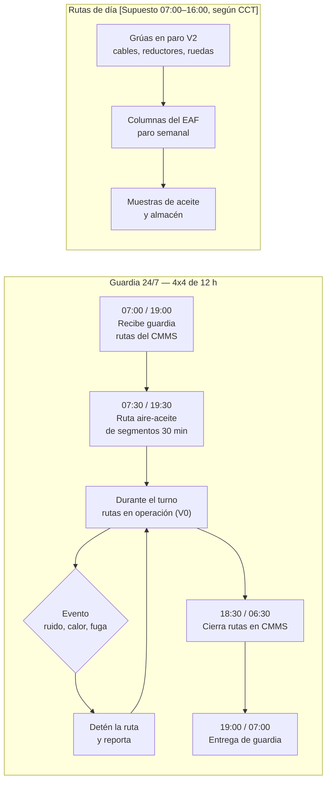
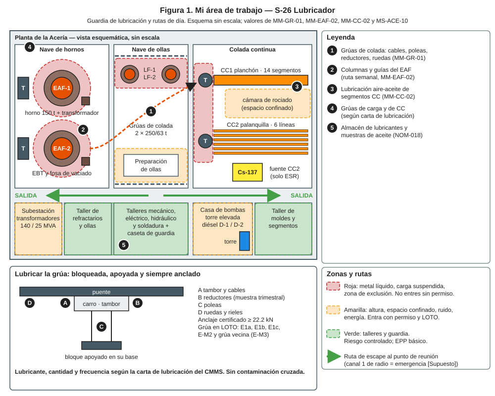
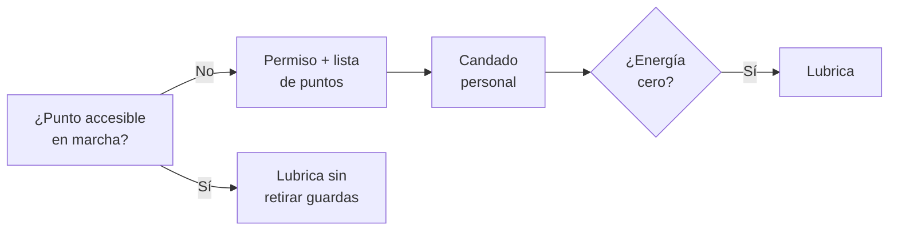
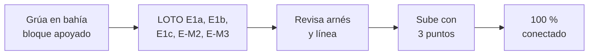
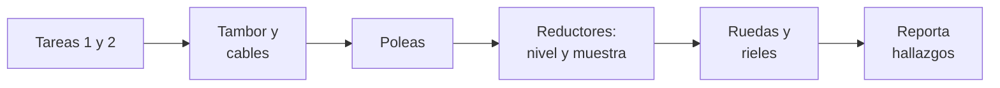
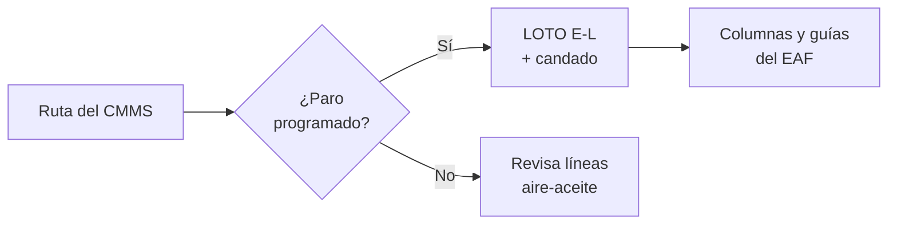

# IT-ACE-S26 — Instrucción de Trabajo: S-26 Lubricador

## 1. Encabezado de control

| Campo | Valor |
|---|---|
| Código | IT-ACE-S26 |
| Versión | 0.1 |
| Estado | Borrador para validación |
| Rol | S-26 Lubricador · sindicalizado — categoría única N-3 (entrada al escalafón de mantenimiento) |
| Área | Mantenimiento de Acería: rutas de lubricación de grúas, EAF, LF, CC y transportadores |
| Turno | Guardia 4x4 de 12 h (relevo 07:00 / 19:00) y rutas de lubricación en horario de día · jornada según el CCT [CCT: pedir texto] |
| Reporta a | C-11 Supervisor de Mantenimiento Mecánico |
| Manuales de referencia | MM-GR-01 · apoyo en MM-EAF-02 y MM-CC-02 · MS-ACE-02, -04, -06, -10 · DP-ACE-S (S-26) |
| Elaboró | gerente-personal-sindicalizado (Líder de la Academia de Mantenimiento y Confiabilidad) |
| Revisión técnica | experto-operativo-metalurgia — visto bueno (con observaciones), 2026-09-26 |
| Revisión de seguridad | Pendiente — experto-seguridad-salud |
| Revisión laboral | experto-relaciones-laborales — visto bueno (con observaciones), 2026-09-26 |
| Aprobó | Pendiente — Director |
| Fecha | 2026-09-25 |

> Esta IT resume tu trabajo; **no reemplaza al manual ni a la carta de lubricación**. El lubricante, la cantidad y la frecuencia de cada punto salen de la carta del CMMS.

## 2. Mi puesto en 30 segundos
Ejecuto las rutas de lubricación de grúas, horno, horno olla y colada. Con buena lubricación evito fallas de reductores, cables y rodamientos. En cada ruta uso mis sentidos: escucho, toco con cuidado y miro. Reporto ruidos, calor o fugas antes de que el equipo falle. Muchas rutas son en altura: siempre voy anclado. Sin funciones de mando (LFT art. 9): si algo no está bien, **aviso, detengo y escalo** a C-11.

> ★ **Mis 3 reglas de oro**
> 1. ★ **Si el punto no se alcanza con el equipo en marcha, LOTO con mi candado.**
> 2. ★ **A la grúa solo subo con la grúa bloqueada, el bloque apoyado y 100 % anclado.**
> 3. ★ **Lubricante, cantidad y frecuencia correctos:** sin mezclar ni contaminar.

## 3. Mi turno de 12 horas

- **Meta:** ≥ 98 % de rutas cumplidas y cero fallas por falta de lubricación (DP-ACE-S).

> **Mi jornada (nota laboral).** Mi turno está pactado en el CCT [CCT: pedir texto]. El relevo y la entrega–recepción antes de las 07:00 / 19:00 son tiempo de trabajo (LFT art. 58). Se cuentan en la jornada o se pagan según el CCT. La jornada de 12 h y la reforma de 40 h están en revisión (arts. 59–61 y 66–68) — verificar con Jurídico Laboral.

## 4. Mi área de trabajo

## 5. Mi EPP

| Pictograma | EPP | Cuándo lo uso |
|---|---|---|
| [CASCO] | Casco con barbiquejo, lentes | Siempre; barbiquejo en altura |
| [BOTA] | Botas metatarsales, ropa FR | Siempre en nave |
| [ARNÉS] | Arnés de cuerpo completo con doble línea | Grúas, plataformas y columnas (≥ 1.8 m) |
| [NITRILO] | Guantes de nitrilo | Grasa y aceite |
| [CARETA] | Careta facial | Engrasado a presión y sistemas centralizados |
| [OÍDO] | Protección auditiva | Nave y reductores |
| [ALUMINIZADO] | Ropa aluminizada | Cerca de horno u ollas calientes |

## 6. Mis tareas paso a paso

### Tarea 1 — LOTO con candado personal y energía cero (MS-ACE-02)

| Paso | Qué hago | Cómo verifico (medición) | ★ |
|---|---|---|---|
| 1 | Revisa en la carta si el punto se alcanza con el equipo en marcha. | Sin retirar guardas; lejos de partes en movimiento. | ★ |
| 2 | Si no, pide el permiso y la lista de puntos a C-11. | Permiso firmado. | ★ |
| 3 | Pon **tu** candado personal en la caja grupal. | Un candado por persona; nunca prestado. | ★ |
| 4 | Verifica la prueba de energía cero antes de acercarte. | Arranque rechazado; 0 bar en líneas de lubricación. | ★ |
| 5 | Al terminar: saca herramientas y quita tu candado. | Personal contado; nadie en el equipo. | ★ |

> 🛑 **ALTO — detén y avisa si…**
> - Tienes que retirar una guarda con el equipo en marcha.
> - El equipo se mueve en la prueba de arranque.

### Tarea 2 — Subir a la grúa y trabajar en altura (MS-ACE-10, MM-GR-01 paso 5)

| Paso | Qué hago | Cómo verifico (medición) | ★ |
|---|---|---|---|
| 1 | Confirma que S-09 apoyó el bloque y balancín en su base. | Cables sin tensión. | ★ |
| 2 | Confirma LOTO de la grúa y de la grúa vecina con tu candado. | 0 V en colectores (S-20); movimiento rechazado. | ★ |
| 3 | Revisa tu arnés, línea y absorbedor. | Costuras, hebillas, ganchos con doble seguro; absorbedor sin activar. | ★ |
| 4 | Usa solo anclajes certificados. | ≥ 22.2 kN; nunca tuberías, barandales ni charolas. | ★ |
| 5 | Sube con 3 puntos de apoyo; lleva herramientas amarradas. | Zona de abajo delimitada (≥ 3 m [Supuesto]). | |
| 6 | Desplázate con doble línea: una siempre conectada. | Nunca desconectado. | ★ |

> 🛑 **ALTO — detén y avisa si…**
> - El anclaje no está certificado o el arnés tiene daño.
> - No hay plan de rescate (persona abajo en < 15 min).
> - Viento ≥ 40 km/h o tormenta eléctrica en trabajo a la intemperie [Supuesto].

### Tarea 3 — Lubricación de la grúa de colada (MM-GR-01) · R

| Paso | Qué hago | Cómo verifico (medición) | ★ |
|---|---|---|---|
| 1 | Aplica las Tareas 1 y 2 antes de tocar la grúa. | Candado puesto; anclado. | ★ |
| 2 | Lubrica tambor y cables según la carta (semanal o quincenal). | Lubricante y cantidad de la carta. | 🔎 |
| 3 | Mientras lubricas, mira el cable. | Reporta alambres rotos, coca, calor o corrosión. | 🔎 |
| 4 | Lubrica poleas y ruedas. | Sin exceso que escurra a los frenos. | 🔎 |
| 5 | Revisa el nivel de aceite de reductores; toma la muestra trimestral. | Frasco limpio y etiquetado. | 🔎 |
| 6 | Baja, quita tu candado con el personal fuera y registra. | Ruta cerrada en el CMMS. | ★ |

> 🛑 **ALTO — detén y avisa si…**
> - Ves daño en el cable, el gancho o los frenos: la grúa no se usa para colada hasta revisar.
> - Hay ruido o vibración anormal en un reductor.

### Tarea 4 — Rutas en EAF y CC: columnas y aire-aceite de segmentos (MM-EAF-02, MM-CC-02)

| Paso | Qué hago | Cómo verifico (medición) | ★ |
|---|---|---|---|
| 1 | Revisa cada día las líneas aire-aceite de los segmentos. | Consumo normal; sin fugas; 30 min. | 🔎 |
| 2 | En paro semanal, lubrica columnas y guías del EAF con S-19. | Horno en LOTO; tu candado puesto. | ★ |
| 3 | Si intervienes la lubricación de un segmento, aplica E-L con tu candado. | Energía cero probada. | ★ |
| 4 | Registra consumo y anomalías. | Ruta cerrada en el CMMS. | |

> 🛑 **ALTO — detén y avisa si…**
> - Tienes que acercarte al horno o al molde con metal líquido.

## 7. Mis controles críticos (★)
- ☐ Ruta del CMMS y carta de lubricación a la mano.
- ☐ Mi candado personal puesto si el punto no es accesible en marcha.
- ☐ Grúa bloqueada, bloque apoyado y grúa vecina bloqueada.
- ☐ Arnés revisado y anclaje certificado ≥ 22.2 kN.
- ☐ 100 % conectado en altura.
- ☐ Lubricante correcto, sin contaminación cruzada.
- ☐ Derrames limpios; hoja de seguridad del lubricante conocida (NOM-018).

## 8. Si algo sale mal

| Síntoma | Qué hago | A quién aviso |
|---|---|---|
| Caída o persona suspendida en el arnés | Activa el rescate de inmediato; mueve las piernas si eres tú. | C-04, brigada · radio canal 1 (emergencia) [Supuesto] |
| La grúa se mueve con LOTO | 🛑 Detén todo; sal del punto de atrapamiento. | C-11, C-16 · canal 1 [Supuesto] |
| Ruido, calor o vibración anormal | Detén tu ruta y reporta. | C-11 · canal de mantenimiento [Supuesto] |
| Alambres rotos o daño por calor en cable | Reporta; la grúa no se usa para colada. | C-11, C-04 |
| Derrame de lubricante | Contén con kit antiderrame; limpia. | C-11 |
| Detector de gases en alarma | Sal y ventila. | C-16 |

## 9. Registros que lleno

| Registro | Cuándo | Dónde |
|---|---|---|
| Ruta de lubricación cumplida (puntos, lubricante, cantidad) | Cada ruta | CMMS |
| Anomalías detectadas | Cada hallazgo | Aviso en CMMS |
| Muestras de aceite de reductores | Trimestral | Etiqueta del frasco y CMMS |
| Control del almacén de lubricantes | Semanal | Bitácora del almacén |
| Permiso y candado | Cada LOTO | Permiso de trabajo |

## 10. Mi certificación

| Concepto | Detalle |
|---|---|
| Nivel ILUO requerido | **U** para ejecutar solo las rutas (categoría única N-3). Con OJT en curso: **L** |
| Teoría | Ruta técnica 24 h (lubricación, CMMS, altura, LOTO) · MM-GR-01 8 h · MM-CC-02 8 h |
| OJT | 180 h: 15 turnos en cada ruta · 4 rutas de lubricación en la grúa · 2 intervenciones en MM-CC-02 |
| Pasos ★ que me evalúan | MM-GR-01: 3–5 (candado, energía cero, siempre anclado) y 10 · MM-CC-02: 3 (E-L) · MS-ACE-02: 5–9, 11 |
| Vigencia | **12 meses:** alturas (MS-ACE-10), grúas e izaje (MS-ACE-04, MM-GR-01). **24 meses:** demás TD-P07 |
| DC-3 / NOM | NOM-009, NOM-006 (acceso a grúas), NOM-018, NOM-017 — verificar con Jurídico Laboral / SSO |
| Mi siguiente paso | S-19 Mecánico C (N-5): 24 meses [Supuesto] + certificaciones de MS-ACE-05 y MM-GR-01 (inspección) |

> **Mi evaluación no es una sanción** (nota laboral — verificar con Jurídico Laboral)
> - La evaluación TD-P07 sirve para formarme, certificarme y acreditar mi aptitud. No se usa para sancionarme (DP-ACE-S §4).
> - Si aún no demuestro un paso ★, conservo mi categoría, mi salario y mi antigüedad. Recibo retroalimentación, OJT de refuerzo y otra oportunidad [Supuesto: 2 en ≤ 60 días, a validar con la CMCAP].
> - Si ya sé hacer el trabajo, puedo pedir el **examen de suficiencia** (LFT art. 153-U). Si lo apruebo, recibo mi DC-3 sin cursar toda la ruta.
> - La certificación prueba mi aptitud para ascender. Entre los aptos, asciende el de mayor antigüedad (LFT arts. 154–159 y CCT).
> - Si mi certificación se suspende tras un incidente grave, es una medida de seguridad, no una sanción. Paso a tarea no crítica sin perder salario ni antigüedad y me reevalúan en ≤ 15 días [Supuesto].
> - Mi capacitación y mis recertificaciones son en jornada y sin costo para mí. Si caen en mi descanso, se pagan según el CCT [CCT: pedir texto].

## 11. Glosario rápido
- **Carta de lubricación:** lista de puntos, lubricante, cantidad y frecuencia.
- **Ruta:** recorrido programado de lubricación en el CMMS.
- **Aire-aceite:** sistema que lleva gotas de aceite con aire a los rodamientos.
- **Reductor:** caja de engranes que baja la velocidad del motor.
- **Contaminación cruzada:** mezclar lubricantes distintos o meter suciedad.
- **Anclaje certificado:** punto que resiste ≥ 22.2 kN por persona.
- **Doble línea:** dos cabos para estar siempre conectado al moverte.
- **LOTO:** bloqueo con candado personal y tarjeta.

## 12. Control de cambios

| Versión | Fecha | Cambio | Autor |
|---|---|---|---|
| 0.1 | 2026-09-25 | Emisión inicial para validación, a partir de DP-ACE-S (S-26), MM-GR-01, MM-EAF-02, MM-CC-02, MS-ACE-02 y MS-ACE-10 | gerente-personal-sindicalizado (Academia de Mantenimiento y Confiabilidad) |
