# Ficha Técnica de la Planta Peletizadora Manzanillo

| Código | Versión | Estado | Custodio | Elaboró | Revisión técnica | Aprobó | Fecha | Próxima revisión |
|---|---|---|---|---|---|---|---|---|
| FT-PEL-001 | 0.1 | **Borrador para validación** | Gerente de Planta (PC-01) + Ingenieros de Proceso (PC-08, PC-09) · custodio técnico: experto-operativo-metalurgia | experto-operativo-metalurgia | Ingeniería de Proceso de la planta — pendiente | **Pendiente — Director de C&D** (validación operativa previa con PC-01) | 2026-09-28 | Al validar con Ingeniería de Proceso / OEM |

> **Mensaje clave.** La Peletizadora Manzanillo convierte ≈ **4.05 Mt/año de concentrado magnético seco** en **4.2 Mt/año de pelet grado reducción directa** en **dos líneas grate-kiln de 2.1 Mt/año** (parrilla móvil + horno rotatorio + enfriador anular). Envía ≈ 3.55 Mt/año por ferrocarril a HYL y Midrex, y ≈ 0.65 Mt/año a venta por el puerto. La ficha es coherente con CV-GASM-001 en volúmenes y en la especificación del pelet, **con una excepción importante**: el concentrado de Fe 66–68 % que indica CV-GASM-001 §3 **no alcanza** para un pelet de Fe ≥ 67.0 %. Hace falta un concentrado de **Fe ≈ 70 %** (ver §12).

> ⚠️ **Fuente única de datos técnicos de la Peletizadora.** Todos los manuales (MO-PEL, MM-PEL, MS-PEL), descripciones de puesto, POV y materiales de capacitación usan los valores de esta ficha. Son **valores de referencia típicos de la industria** para una planta grate-kiln que procesa concentrado de magnetita. **Antes de usar cualquier manual en planta**, Ingeniería de Proceso (PC-08, PC-09) debe validarlos contra los manuales de los fabricantes (OEM), las especificaciones de GASM y los datos reales de operación. Si un valor cambia, se cambia primero aquí y después en CV-GASM-001 si toca una interfaz.
>
> Convenciones: **[Supuesto]** = valor típico de la industria, no confirmado en la planta. **[Validar con OEM]** = depende del fabricante del equipo. **[Validar con C-07 RD]** = lo fija la Ingeniería de Proceso de Reducción Directa (cliente interno).

## 1. Alcance y flujo del proceso

```mermaid
flowchart LR
    subgraph REC["1 · Recepción de concentrado"]
        FD["Ferroducto desde<br/>Cerro Tepehuaje<br/>pulpa 62–66 % sólidos"] --> TER["Terminal: estación de<br/>disipación + tanque de<br/>tapones de agua"]
        FC["Ferrocarril desde<br/>Sierra Alta<br/>torta 8–10 % humedad"] --> DES["Tolva de descarga<br/>bajo vía"] --> PAC["Patio de concentrado<br/>cubierto"] --> REP["Repulpeo"]
    end
    subgraph HUM["2–4 · Línea húmeda (común a las 2 líneas)"]
        TER --> ESP["Espesadores y tanques<br/>homogeneizadores"]
        REP --> ESP
        CAL["Molino de caliza<br/>(pulpa de caliza)"] --> ESP
        ESP --> FIL["Filtros cerámicos<br/>de disco"] --> HPGR["Prensa de rodillos<br/>(HPGR)"] --> MEZ["Mezclador<br/>+ bentonita"]
    end
    subgraph PEL["5 · Peletizado (por línea)"]
        MEZ --> DIS["Discos peletizadores<br/>Ø 7.5 m"] --> CRV["Criba de rodillos<br/>pelet verde 9–16 mm"]
        CRV -- "menor de 9 mm y mayor de 16 mm<br/>(recirculación)" --> MEZ
    end
    subgraph GK["6–8 · Endurecimiento grate-kiln (Línea 1 y Línea 2)"]
        CRV --> PAR["Parrilla móvil<br/>secado + precalentamiento"] --> HOR["Horno rotatorio<br/>cocción 1,260–1,310 °C"] --> ENF["Enfriador anular<br/>descarga ≤ 100 °C"]
        ENF -. "aire caliente<br/>(recuperación de calor)" .-> HOR
        ENF -. "aire caliente" .-> PAR
        PAR --> PE["Precipitador<br/>electrostático → chimenea"]
    end
    subgraph PRO["9–12 · Producto"]
        ENF --> CRI["Cribado de<br/>pelet cocido"] --> REC2["Recubrimiento<br/>antipegado"] --> PAT["Patio de pelet<br/>apiladora-recuperadora"]
        CRI -- "finos menores de 6.3 mm" --> FIN["Patio de finos"]
        PAT --> TRE["Silo de carga<br/>de trenes"] --> RD["Ferrocarril ≈ 1,000–1,200 km<br/>→ HYL / Midrex"]
        PAT --> PUE["Banda al muelle →<br/>cargador de barcos"] --> VEN["Venta / exportación"]
    end
```

| Área | Equipos principales | Producto de la etapa |
|---|---|---|
| Recepción de concentrado | Terminal del ferroducto; tolva de descarga de ferrocarril; patio de concentrado; repulpeo | Pulpa de concentrado |
| Línea húmeda | Espesadores, tanques homogeneizadores, molino de caliza, filtros cerámicos, prensa de rodillos (HPGR), silos de aditivos, mezcladores | Mezcla húmeda (torta + aglomerante) |
| Peletizado | 10 discos peletizadores (5 por línea), cribas de rodillos | Pelet verde 9–16 mm |
| Endurecimiento | 2 líneas grate-kiln: parrilla móvil, horno rotatorio, enfriador anular, ventiladores de proceso, precipitadores | Pelet cocido |
| Producto y embarque | Cribas de pelet cocido, recubrimiento, patio con apiladoras-recuperadoras, silo de carga de trenes, banda al muelle y cargador de barcos | Pelet DR en tren o en buque |

**Producción de diseño:** 4.2 Mt/año de pelet cocido, en 2 líneas de 2.1 Mt/año. Referencia de ≈ 8,000 h/año de operación por línea [Supuesto], es decir ≈ 262 t/h por línea (nominal 265 t/h; máximo de diseño 300 t/h [Validar con OEM]). La operación es continua 24/7, con 4 cuadrillas en rol 4x4 de 12 h.

**¿Por qué 2 líneas?** [Supuesto de diseño] Con 2 líneas, un paro mayor de una línea (refractario del horno, parrilla) deja ≈ 50 % de la capacidad. Además, la dotación de ≈ 800 personas de la unidad corresponde mejor a 2 líneas que a una línea única de 4.2 Mt/año. Si la planta real tiene una sola línea, se ajustan las §2 a §11 y el organigrama.

## 2. Balance de materiales de referencia

| Concepto | Valor de referencia | Nota |
|---|---|---|
| Pelet cocido | 4.2 Mt/año · ≈ 525 t/h (2 líneas) | CV-GASM-001 §3 |
| Concentrado seco requerido | ≈ 0.96–0.97 t por t de pelet → **≈ 4.05–4.10 Mt/año** (≈ 510 t/h) | La magnetita gana ≈ 3–3.5 % de masa al oxidarse a hematita, y los aditivos suman ≈ 1 %. CV-GASM-001 indica "≈ 1.0 t/t"; es coherente como aproximación [Supuesto] |
| Por ferroducto (Cerro Tepehuaje) | ≈ 3.05 Mt/año seco [Supuesto] | ≈ 75 % de la alimentación |
| Por ferrocarril (Sierra Alta) | ≈ 1.0 Mt/año seco [Supuesto]; ≈ 110 trenes/año de ≈ 90 carros | Puede ser carga de retorno de los trenes vacíos de pelet que regresan del norte [Supuesto; validar con Logística] |
| Bentonita | 5–7 kg/t de concentrado (0.5–0.7 %) [Supuesto] | ≈ 20–28 kt/año |
| Caliza (ajuste de basicidad) | 5–20 kg/t, según la basicidad objetivo [Validar con C-07 RD] | Molida en húmedo a P80 ≤ 45 µm |
| Material de recubrimiento | 1.5–3.0 kg/t de pelet (base seca) [Validar con OEM] | Cal hidratada, dolomita o bauxita |
| Finos de pelet cocido (< 6.3 mm) | 2–4 % de la producción [Supuesto] | A patio de finos: remolienda o venta |
| Destino del pelet | ≈ 3.55 Mt a Reducción Directa (HYL + Midrex) · ≈ 0.65 Mt a venta por puerto | CV-GASM-001 §3 |
| Trenes de pelet a RD | ≈ 9,700 t/día → **≈ 1 tren unitario por día** (≈ 100 carros tolva de ≈ 95 t) [Supuesto] | ≈ 370 trenes/año |
| Buques de venta | ≈ 10–13 buques/año (Supramax 50–60 kt o Panamax 70–75 kt) [Supuesto] | |

## 3. Recepción de concentrado

### 3.1 Terminal del ferroducto (pulpa desde Cerro Tepehuaje)
| Parámetro | Valor de referencia |
|---|---|
| Alimentación | Pulpa de concentrado de magnetita; 62–66 % de sólidos en peso (objetivo 64 %) [Supuesto] |
| Granulometría que llega | P80 40–50 µm; 80–90 % < 45 µm (malla 325) [Supuesto] |
| Flujo | ≈ 380–400 t/h de sólidos secos, con operación continua del ferroducto [Supuesto] |
| Estación de disipación de presión | Estranguladores cerámicos (chokes) para bajar la presión de llegada antes de los tanques [Validar con OEM] |
| Densidad de pulpa | Densímetro en línea (nuclear, fuente sellada de Cs-137, o no nuclear) [Supuesto]. Si es nuclear, aplica MS-PEL-05 y la licencia de la CNSNS |
| Tapones de agua (arranque, paro y limpieza del ducto) | Se desvían al **estanque de emergencia de la terminal** (≈ 1 día de flujo del ducto [Supuesto]); no entran a los tanques de proceso. La maniobra se coordina por radio y teléfono con el cuarto de control del ferroducto de la mina |
| Alarma de densidad baja a la llegada | < 55 % de sólidos: desviar al estanque y avisar a PC-07 y a la mina [Supuesto] |
| Agua que llega con la pulpa | ≈ 0.55 m³ por t de concentrado. Se recupera en espesadores y filtros; el excedente se trata antes de descargarlo (NOM-001-SEMARNAT — verificar con Medio Ambiente) |

### 3.2 Descarga de ferrocarril (concentrado desde Sierra Alta)
| Parámetro | Valor de referencia |
|---|---|
| Carros | Góndolas o tolvas de descarga por el fondo, ≈ 90 t netas [Supuesto] |
| Humedad del concentrado | 8–10 % (torta filtrada en la mina) [Supuesto] |
| Descarga | Tolva bajo vía con vibradores de carro; ≈ 1,500 t/h; tren completo en ≈ 6 h [Supuesto] |
| Movimiento de carros en la planta | Tractor de vía (trackmobile) o cabrestante de posicionamiento [Supuesto]. El concesionario ferroviario deja y recoge el tren en la vía de la planta |
| Patio de concentrado | Cubierto, ≈ 60–80 kt (≈ 3–4 semanas del consumo por ferrocarril) [Supuesto]; cargadores frontales |
| Repulpeo | Tanque agitado de repulpeo; la pulpa (≈ 60–65 % de sólidos) se une a la del ferroducto en los espesadores |

## 4. Espesamiento, homogeneización y filtrado

| Parámetro | Valor de referencia |
|---|---|
| Espesadores | 2 de alta capacidad, Ø ≈ 30 m [Supuesto]; descarga (underflow) 68–72 % de sólidos; agua clara recuperada < 200 mg/L de sólidos |
| Floculante | Dosis ≈ 10–20 g/t [Supuesto; validar con proveedor] |
| Tanques homogeneizadores | 4 tanques agitados de ≈ 3,000 m³ [Supuesto]; ≈ 24 h de pulmón entre la recepción y los filtros |
| Pulpa de caliza | Se dosifica a los tanques homogeneizadores según la basicidad objetivo (§5) |
| Filtros | **8 filtros cerámicos de disco de ≈ 144 m²** (6 en operación y 2 en limpieza o reserva) [Supuesto; validar con OEM]. Alternativa equivalente: filtros de disco al vacío convencionales |
| Capacidad específica | 0.6–0.8 t/m²·h de sólidos secos [Validar con OEM] |
| Humedad de la torta | **Objetivo 9.0 %; rango 8.5–9.5 %.** Alarma > 9.8 %: el pelet verde se deforma y pierde resistencia en la parrilla; < 8.3 %: el pelet verde no crece bien en el disco |
| Vacío | −0.90 a −0.95 bar en filtro cerámico [Validar con OEM]. Vacío bajo = placas tapadas o fuga |
| Limpieza de placas cerámicas | Retrolavado continuo; limpieza **ultrasónica** y **química con ácido** (nítrico u oxálico, según OEM) cada 8–12 h por filtro [Validar con OEM]. ⚠️ Manejo de ácidos: MS-PEL-05 |
| Filtrado | Agua clara (< 50 mg/L de sólidos) a la red de agua de proceso |
| Muestreo | Humedad de la torta cada 2 h (horno de secado o analizador en línea) |

## 5. Molienda por rodillos, aditivos y mezcla

| Parámetro | Valor de referencia |
|---|---|
| Prensa de rodillos (HPGR) | 1 por línea sobre la torta filtrada, ≈ 300 t/h [Supuesto; validar con OEM]. Sube la superficie específica +200 a +400 cm²/g |
| Superficie específica (Blaine) de la mezcla | **Objetivo 1,900 cm²/g; rango 1,800–2,100 cm²/g** [Supuesto]. Por debajo, baja la resistencia del pelet verde y del cocido |
| Bentonita | **5–7 kg/t de concentrado** (objetivo 6.0 kg/t) [Supuesto]. Silos con descarga neumática y dosificador de pérdida de peso. Exceso de bentonita = más ganga (SiO₂ + Al₂O₃) y menos Fe |
| Índice de hinchamiento de la bentonita | ≥ 25 mL/2 g; absorción de agua ≥ 600 % (recepción por lote) [Supuesto] |
| Caliza | Molino de bolas en húmedo; P80 ≤ 45 µm; dosis 5–20 kg/t según la basicidad (§11.2) |
| Cal hidratada (opcional) | 0–3 kg/t como complemento del aglomerante [Supuesto] |
| Mezcladores | 1 mezclador intensivo por línea (≈ 300 t/h) con derivación (bypass) [Validar con OEM] |
| Control | Relación bentonita/concentrado por el DCS; la báscula de banda de torta manda la dosis |

## 6. Peletizado en discos y clasificación del pelet verde

| Parámetro | Valor de referencia |
|---|---|
| Discos | **10 discos de Ø 7.5 m** (5 por línea: 4 en operación y 1 de reserva o en mantenimiento) [Supuesto; validar con OEM] |
| Capacidad por disco | ≈ 70–80 t/h de pelet verde en tamaño [Supuesto] |
| Ángulo del disco | 45–48° [Validar con OEM] |
| Velocidad | 6–8 rpm (≈ 45–55 % de la velocidad crítica) [Validar con OEM] |
| Agua de adición en el disco | Rocío fino; ajuste de ± 0.3 % de humedad |
| Raspadores | Fijos o giratorios; mantienen una capa de fondo uniforme |
| Criba de pelet verde | Criba de rodillos en cada disco o por línea: finos < 9 mm y sobretamaño > 16 mm regresan al mezclador (el sobretamaño se desintegra primero) |
| Carga circulante | 15–30 % [Supuesto]. > 35 %: revisar humedad, Blaine o bentonita |
| Alimentación a la parrilla | Banda ancha oscilante + alimentador de rodillos, para formar una cama uniforme |

**Especificación del pelet verde** (🔎 variables críticas):
| Variable | Objetivo / rango | Frecuencia | Si está fuera de rango |
|---|---|---|---|
| Tamaño 9–16 mm | ≥ 90 % (objetivo 94 %); < 9 mm ≤ 5 % | Cada 2 h por línea + cámara en línea [Supuesto] | Ajustar agua, velocidad o ángulo del disco; avisar a PC-05 |
| Humedad | 8.5–9.5 % (objetivo 9.0 %) | Cada 2 h | Ajustar el filtrado (§4) y el agua del disco |
| Número de caídas (drop number, 46 cm sobre placa de acero) | ≥ 5 caídas (objetivo 6–8) [Supuesto] | Cada 2 h | Revisar bentonita y Blaine |
| Resistencia en húmedo | ≥ 1.0 kg/pelet [Supuesto] | Cada 2 h | Idem |
| Resistencia en seco (105 °C) | ≥ 4.5 kg/pelet [Supuesto] | Cada 4 h | Idem |

## 7. Parrilla móvil: secado y precalentamiento (por línea)

| Parámetro | Valor de referencia |
|---|---|
| Tipo | Parrilla móvil de cadena con placas de aleación resistente al calor [Validar con OEM] |
| Dimensiones | Ancho ≈ 4.5 m; longitud efectiva ≈ 50 m (≈ 225 m²) [Validar con OEM] |
| Altura de cama | 180–220 mm (objetivo 200 mm) |
| Velocidad | 2.0–3.5 m/min (tiempo en la parrilla ≈ 15–22 min) |
| Zonas y temperatura del gas | **Secado ascendente (UDD):** 250–350 °C (aire de la zona 3 del enfriador) · **Secado descendente (DDD):** 350–450 °C · **Precalentamiento templado (TPH):** 600–900 °C (aire de la zona 2 del enfriador) · **Precalentamiento (PH):** 1,000–1,150 °C (gases de salida del horno) [Validar con OEM] |
| ⚠️ Choque térmico | El pelet verde húmedo que entra directo a gas > 450 °C revienta (spalling): genera finos, acreciones en el horno y pérdida de producción. Por eso el secado es gradual |
| Resistencia del pelet a la entrada del horno | ≥ 25 kg/pelet (objetivo ≥ 35 kg/pelet) [Supuesto]. Si es menor, se rompe en el horno y forma anillos |
| Temperatura de las placas / cadenas | Alarma > 450 °C en la cadena de retorno [Validar con OEM] |
| Gases a la chimenea | Entrada al precipitador **110–160 °C**. Alarma < 95 °C (condensación ácida y corrosión) y > 200 °C (daño al precipitador) [Supuesto] |
| Presión en las cajas de viento | Según el perfil del OEM; se vigila la diferencia entre zonas para evitar fugas de gas caliente al ambiente |

## 8. Horno rotatorio y quemador (por línea)

| Parámetro | Valor de referencia |
|---|---|
| Dimensiones | Ø ≈ 5.8 m × ≈ 38 m; pendiente ≈ 4 % [Validar con OEM] |
| Velocidad | 0.8–1.5 rpm (tiempo de residencia ≈ 20–30 min) |
| Grado de llenado | 6–8 % del volumen interno [Supuesto] |
| **Temperatura de cocción del pelet** | **Objetivo 1,290 °C; rango 1,260–1,310 °C** (pirómetro de cama y cámara térmica) [Validar con OEM / Ingeniería de Proceso]. < 1,250 °C: baja la resistencia a la compresión (CCS). > 1,320 °C: fusión incipiente, pegado del pelet y acreciones |
| Gas a la salida del horno (hacia la zona PH) | 1,050–1,150 °C |
| Quemador | Quemador multicanal de gas natural, uno por horno. Aire secundario de la zona 1 del enfriador a 950–1,100 °C [Validar con OEM] |
| Combustible de respaldo | Diésel o combustóleo, solo si Ingeniería lo aprueba y el permiso ambiental lo permite [Supuesto] |
| Sistema de gestión de quemadores (BMS) | Purga obligatoria antes de encender (≥ 5 cambios de volumen), detector de flama, válvulas de doble bloqueo y venteo, disparos por pérdida de flama o por presión alta o baja de gas (NFPA 85/86 como referencia) [Validar con OEM]. ⚠️ MS-PEL-01 |
| Refractario | Ladrillo de alta alúmina (60–70 % Al₂O₃) en la zona de cocción; concreto refractario en cabezales y transición [Validar con OEM]. Campaña ≥ 2 años en la zona del quemador [Supuesto] |
| **Temperatura de la coraza (escáner)** | Normal 200–300 °C. **Alarma > 350 °C** (punto caliente: refractario delgado o caído). **> 400 °C sostenido: bajar carga y preparar paro** [Validar con OEM] |
| Acreciones (anillos) | Principal causa de paro no programado. Se forman con finos y pelet roto (pelet verde débil, choque térmico, cocción > 1,320 °C). Se vigilan con cámara, escáner y par (corriente) del motor del horno |
| Accionamiento | Motor principal con reductor y corona-piñón. **Accionamiento auxiliar** (motor diésel o motor alimentado por el generador de emergencia) |
| 🛑 Pérdida de energía con el horno caliente | Arrancar el giro auxiliar en ≤ 5 min y girar **¼ de vuelta cada 5–10 min** hasta que la coraza baje de ≈ 150 °C, para que no se deforme [Validar con OEM]. Abrir la chimenea de emergencia para proteger la parrilla. MO-PEL-05 |
| Emisiones | Material particulado, SO₂ (azufre del concentrado) y NOx; monitoreo continuo en chimenea (CEMS). Límites de la NOM-043-SEMARNAT y de la licencia ambiental — verificar con Medio Ambiente |

## 9. Enfriador anular (por línea)

| Parámetro | Valor de referencia |
|---|---|
| Tipo | Enfriador anular (circular) con carros de fondo perforado y descarga por volteo [Validar con OEM] |
| Dimensiones | Diámetro medio ≈ 18 m; ancho de cama ≈ 3 m; área ≈ 170 m²; altura de cama 0.70–0.80 m [Supuesto] |
| Tiempo de enfriamiento | 50–60 min |
| Zonas | **Zona 1:** aire a 950–1,100 °C → aire secundario del horno · **Zona 2:** 600–900 °C → TPH de la parrilla · **Zona 3:** 250–350 °C → UDD de la parrilla o a la chimenea [Validar con OEM] |
| **Temperatura del pelet a la descarga** | **Objetivo ≤ 100 °C.** Alarma > 120 °C. **> 150 °C: detener la alimentación a la banda** (banda resistente al calor clase de ≤ 150 °C [Validar con OEM]) |
| Sellos | Sellos de agua o mecánicos entre los carros y las cámaras de viento; una fuga de sello baja la recuperación de calor y sube el consumo de gas |

## 10. Cribado, recubrimiento, patio, trenes y puerto

| Etapa | Parámetro | Valor de referencia |
|---|---|---|
| Cribado de pelet cocido | Cribas | 2 cribas vibratorias por línea; malla de 6.3 mm (finos) [Supuesto] |
| | Finos < 6.3 mm | 2–4 % de la producción. Alarma > 5 %: pelet débil o acreción suelta; avisar a PC-09 |
| Recubrimiento (coating) | Material | Lechada de cal hidratada, dolomita o bauxita al 15–25 % de sólidos [Validar con OEM y C-07 RD] |
| | Dosis | 1.5–3.0 kg/t de pelet (base seca); rocío en la transferencia, con dosificación proporcional al flujo de la báscula de banda |
| | Humedad que agrega | ≈ 0.5–1.0 % |
| | Aplicación | Solo al pelet para HYL y Midrex; el pelet de venta según contrato |
| Patio de pelet | Capacidad | ≈ 500 kt (≈ 5–6 semanas) [Supuesto]; pilas separadas: pelet DR recubierto, pelet de venta, finos |
| | Equipos | 2 apiladoras-recuperadoras (apilado ≈ 600 t/h; recuperación ≈ 3,000 t/h) [Supuesto] |
| Carga de trenes | Silo de carga | Silo sobre vía con tolva de pesaje por lotes, ≈ 3,000–4,000 t/h; tren de 100 carros en ≈ 3–4 h [Supuesto] |
| | Pesaje | Tolva de pesaje por lote + báscula dinámica de vía (verificación) |
| | Liberación del tren | Muestra compuesta por tren (ISO 3082), certificado de calidad por tren y documentos de porte |
| | Carros | Tolvas cerradas o con lona para cumplir la humedad ≤ 2 % a la llegada [Supuesto; ver §12] |
| Puerto | Banda al muelle | ≈ 3 km, cerrada [Supuesto] |
| | Cargador de barcos | ≈ 3,000 t/h; buque de 60 kt en ≈ 24–30 h efectivas [Supuesto] |
| | Control | Medición de calado (draft survey), muestreo por lote, supresión de polvo; operación sujeta a la concesión y reglas del puerto (Ley de Puertos y reglas de la Administración Portuaria — verificar con Jurídico) |

## 11. Control de calidad del pelet

### 11.1 Propiedades físicas y metalúrgicas del pelet cocido (especificación de embarque a RD)
Coincide con CV-GASM-001 §4.1. Lo que no está en CV-GASM-001 se marca como propuesta.

| Variable (🔎) | Especificación | Método de referencia | Frecuencia | Registro |
|---|---|---|---|---|
| Resistencia a la compresión (CCS) | **≥ 250 kg/pelet promedio** (objetivo 280); pelet < 150 kg ≤ 10 % [Propuesta] | ISO 4700 (60 pelets de 10–12.5 mm) | Cada 2 h por línea + compuesto por tren | LIMS; gráfica de control |
| Índice de volteo (tumble, + 6.3 mm) | **≥ 94 %** | ISO 3271 | Por turno por línea + por tren | LIMS |
| Índice de abrasión (− 0.5 mm) | **≤ 5 %** | ISO 3271 | Por turno por línea + por tren | LIMS |
| Tamaño | **9–16 mm ≥ 90 %; < 6.3 mm ≤ 3 %**; > 16 mm ≤ 5 % [Propuesta] | ISO 4701 | Cada 2 h por línea + por tren | LIMS |
| Humedad al embarque | **≤ 2 %** | ISO 3087 | Por tren y por lote de buque | Certificado |
| Porosidad | 20–26 % [Supuesto] | Picnometría | Semanal | LIMS |
| Reducibilidad para RD (grado de metalización en prueba) | ≥ 93 % de metalización en la prueba [Validar con C-07 RD] | ISO 11258 | Semanal y por cambio de mezcla | LIMS |
| Hinchamiento en reducción | ≤ 15 % [Supuesto] | ISO 4698 | Semanal | LIMS |
| Tendencia al pegado (clustering) | Según el límite que fije C-07 RD | ISO 11256 | Mensual y por cambio de recubrimiento | LIMS |
| Desintegración a baja temperatura (DR) | Según el límite que fije C-07 RD | ISO 11257 | Mensual | LIMS |

> Norma y edición vigentes de cada método ISO: **[Validar con Laboratorio de GASM]**.

### 11.2 Química del pelet cocido
| Elemento | Especificación | Nota |
|---|---|---|
| Fe total | **≥ 67.0 %** (objetivo 67.5 %) | CV-GASM-001 §4.1. Requiere concentrado de Fe ≈ 70 % (ver §12) |
| SiO₂ + Al₂O₃ | **≤ 3.0 %** (objetivo ≤ 2.5 %) | CV-GASM-001 §4.1. Cada 1 kg/t de bentonita suma ≈ 0.07 % de SiO₂ + Al₂O₃ [Supuesto] |
| Basicidad B2 (CaO/SiO₂) | **Baja**, según la práctica de RD. Valor de arranque propuesto: 0.3–0.8, objetivo 0.5 [Supuesto; **validar con C-07 RD**] | Define la dosis de caliza (§5) |
| FeO | ≤ 0.5 % (oxidación completa de la magnetita) [Supuesto] | FeO alto = cocción u oxidación insuficiente en la parrilla |
| P | ≤ 0.03 % [Supuesto] | Pasa al acero; el EAF lo tiene que quitar |
| S | ≤ 0.01 % [Supuesto] | |
| Álcalis (Na₂O + K₂O) | ≤ 0.10 % [Supuesto] | |
| TiO₂, V, Cu | Según el cliente interno [Validar con C-07 RD / C-09 Acería] | Residuales que pasan al acero |
| Método | FRX (fluorescencia de rayos X) calibrada; Fe total por titulación (ISO 2597); FeO (ISO 9035) | Compuesto cada 8 h por línea y por tren |

### 11.3 Control estadístico y liberación
- Gráficas de control (X̄–R) de CCS, volteo, finos < 6.3 mm, Fe y SiO₂. Meta de capacidad: **Cpk ≥ 1.33** en CCS y en tamaño [Supuesto].
- **Liberación por tren:** PC-10 (o el analista de turno autorizado) libera el tren con el certificado de calidad. Un tren fuera de especificación no sale sin la autorización escrita de PC-10 y el aviso a C-07 de RD.
- Retención de muestras testigo: 90 días por tren y 1 año por buque [Supuesto].

## 12. Coherencia con CV-GASM-001 (puntos que no cuadran)

| # | Tema | CV-GASM-001 | Hallazgo técnico | Propuesta (no aprobada) |
|---|---|---|---|---|
| 1 | **Ley del concentrado** | Concentrado Fe 66–68 % [Supuesto] (§3) y pelet Fe ≥ 67.0 % (§4.1) | Con magnetita, el pelet queda ≈ 2.5–3 puntos **por debajo** del Fe del concentrado: al oxidarse gana ≈ 3–3.5 % de masa y los aditivos suman ≈ 1 %. Un concentrado de 67 % de Fe da un pelet de ≈ 64–64.5 % (grado alto horno, no grado RD) | Especificar el concentrado para pelet DR en **Fe ≥ 69.5–70.5 % y SiO₂ ≤ 2.0 %** (requiere flotación inversa o una etapa magnética adicional en las concentradoras) **o** bajar la especificación del pelet a Fe ≥ 65.5 %, con más escoria y más energía en el EAF. Decide la Dirección de Operaciones con C-07 RD |
| 2 | **Volumen de concentrado** | 6.5 Mt de concentrado (§3) | El pelet solo necesita ≈ 4.05–4.10 Mt. Quedan **≈ 2.4 Mt/año sin destino** en CV-GASM-001 (¿venta de concentrado? ¿inventario?) | Aclarar el destino en CV-GASM-001 §3 |
| 3 | Dónde se aplica el recubrimiento | "Antipegado para el reactor" (§4.1) | Con ≈ 1,000–1,200 km de ferrocarril y 3–4 transferencias, se pierde parte del recubrimiento antes de llegar al reactor | Recubrir en la Peletizadora (base de esta ficha) y que C-07 RD decida si hace falta un recubrimiento adicional en la RD |
| 4 | Humedad ≤ 2 % | "Al embarque" (§4.1) | Manzanillo tiene lluvias intensas (junio a octubre) y temporada de huracanes. Con carros abiertos, el pelet puede llegar con > 2 % | Medir la humedad **a la llegada** a RD y usar tolvas cerradas o lonas [Supuesto] |
| 5 | Basicidad | "Baja para evitar pegado" sin valor | Sin un valor no se puede calcular la dosis de caliza ni evaluar la calidad | C-07 RD fija el rango; propuesta de arranque B2 0.3–0.8 |
| 6 | Distancia de ferrocarril | ≈ 1,000 km | Por la ruta ferroviaria, Manzanillo → Salinas Victoria son ≈ 1,000–1,200 km [Supuesto] | Sin impacto en esta ficha; confirmar con Logística |

> **Nota fuera de alcance, para el custodio de FT-ACE-001:** la ficha de Acería v0.3 todavía dice "60 % DRI + 40 % chatarra" y tiene un patio de chatarra; CV-GASM-001 ya fija ≈ 95–100 % DRI (FT-ACE-001 v0.4). Además, el perfil de empresa menciona una sola planta DRI, mientras que CV-GASM-001 define HYL y Midrex. No se tocó ninguno de los dos documentos.

## 13. Combustibles, energía y servicios

| Servicio | Valor de referencia |
|---|---|
| Gas natural (hornos) | **0.30–0.45 GJ/t de pelet** (la oxidación de la magnetita aporta calor) [Supuesto] ≈ 8–12 Nm³/t; ≈ 2,200–3,300 Nm³/h por línea; ≈ 40–50 millones de Nm³/año. Llega por gasoducto a una estación de regulación y medición de la planta [Supuesto] |
| Energía eléctrica | **35–45 kWh/t de pelet** (incluye filtrado, HPGR, ventiladores, bandas y puerto) [Supuesto]; demanda media ≈ 20–22 MW; subestación principal de 115 kV [Supuesto] |
| Ventiladores de proceso (por línea) | 4–5 ventiladores grandes (gases de salida, recirculación, enfriador), de 1–3 MW cada uno, con variador de velocidad [Validar con OEM] |
| Generador de emergencia | Diésel, arranque automático en ≤ 30 s. Alimenta el giro auxiliar del horno, la lubricación de chumaceras, el ventilador de protección de la parrilla, el DCS y el alumbrado [Supuesto] |
| Aire comprimido | Red de 6–7 bar para instrumentos, limpieza de filtros, transporte neumático de bentonita y sellos |
| Agua | Agua de proceso recuperada (espesadores y filtros) + agua de repuesto; agua de enfriamiento de equipos; red contra incendio (NOM-002-STPS) |
| Precipitadores electrostáticos | 1 por línea, 3–4 campos; transformadores-rectificadores de ≈ 60–80 kV de corriente directa [Validar con OEM]. ⚠️ Alta tensión: MS-PEL-03 |
| Casas de bolsas | En transferencias de bandas, silos de bentonita y cal, y en el cribado |
| Sistema de control | DCS con cuarto de control central (tableros de endurecimiento L1 y L2, y de filtrado y peletizado); PLC en patio, trenes y puerto; escáner de coraza; cámaras térmicas; CEMS |
| Laboratorio | Laboratorio físico (CCS, volteo, tamaño, caídas), químico (FRX, titulación) y metalúrgico (reducibilidad para RD, hinchamiento) |

## 14. Indicadores de desempeño de la planta (KPI) de referencia

| KPI | Meta de referencia [Supuesto] |
|---|---|
| Producción | 4.2 Mt/año; ≈ 525 t/h con 2 líneas |
| Disponibilidad por línea grate-kiln | ≥ 91 % (≈ 8,000 h/año) |
| Paros no programados por acreciones | ≤ 1 por línea por trimestre |
| Gas natural | ≤ 0.40 GJ/t |
| Energía eléctrica | ≤ 42 kWh/t |
| Bentonita | ≤ 6.5 kg/t de concentrado |
| Trenes liberados en especificación | ≥ 98 % |
| CCS, Cpk | ≥ 1.33 |
| Finos < 6.3 mm en el tren | ≤ 3 % |
| Campaña de refractario del horno (zona del quemador) | ≥ 2 años |

## 15. Dotación de referencia (para dimensionar puestos)

El detalle está en `01-organizacion/organigrama-peletizadora.md` (ORG-PEL-001).

| Área | Plazas sindicalizadas [Supuesto] | Plazas de confianza [Supuesto] |
|---|---|---|
| Línea húmeda: filtrado, aditivos, mezcla y discos | 120 | 9 (PC-02, PC-05 ×4, PC-08 ×2, PC-21 ×2) |
| Endurecimiento y producto (parrilla, horno, enfriador, cribado, recubrimiento, servicios) | 107 | 6 (PC-06 ×4, PC-09 ×2) |
| Manejo de materiales y embarques (recepción, patios, trenes, puerto) | 110 | 7 (PC-03, PC-07 ×4, PC-20 ×2) |
| Laboratorio y calidad | 29 | 3 (PC-10) |
| Mantenimiento | 315 | 19 (PC-11, PC-12 ×5, PC-13 ×3, PC-14 ×4, PC-15 ×3, PC-16 ×2, PC-17) |
| Gerencia, jefatura de turno, seguridad y medio ambiente | — | 10 (PC-01, PC-04 ×4, PC-18 ×3, PC-19 ×2) |
| **Subtotal de planta** | **681** | **54** |
| Funciones de apoyo del sitio (RH, C&D, finanzas, abastecimiento y almacén, TI/OT, servicio médico, sistemas de gestión, comunidad y puerto, proyectos) | ≈ 65 (sindicalizados y de confianza) [Supuesto] | |
| **Total de la unidad** | **≈ 800** | Coincide con el perfil de empresa |
| Contratistas (REPSE) | ≈ 400 (puerto, limpieza industrial, refractario en paros, ferrocarril, vigilancia) | `03-department-design/org/04-equipos-de-sitio.md` |

> **Nota del experto:** para una planta grate-kiln de 4.2 Mt/año, la referencia de la industria es de ≈ 450–650 empleados propios [Supuesto]. Los ≈ 800 del perfil de empresa son razonables con 2 líneas, un puerto y un patio ferroviario propios, y con mantenimiento mayor interno. Si el HRIS muestra otra cifra, se ajusta ORG-PEL-001.

## 16. Control de cambios

| Versión | Fecha | Cambio | Elaboró |
|---|---|---|---|
| 0.1 | 2026-09-28 | Emisión inicial por la decisión D-010: alcance, balance, parámetros por etapa, calidad, energía, servicios, KPI, dotación y coherencia con CV-GASM-001 | experto-operativo-metalurgia |
