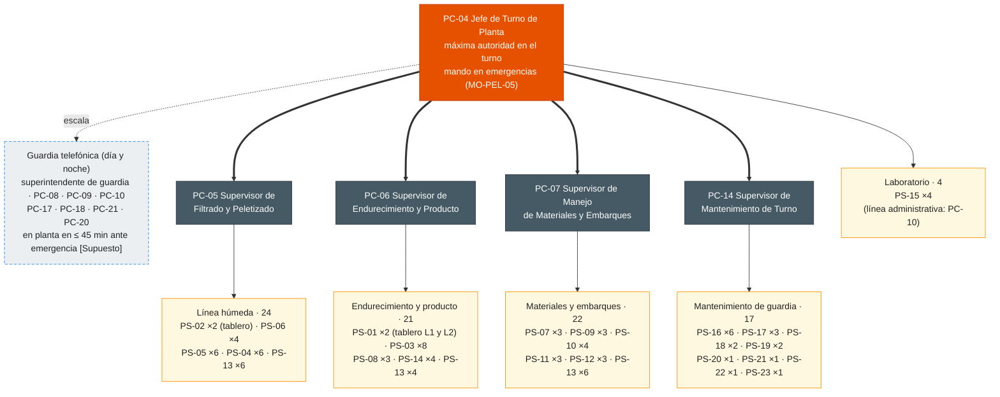

# Organigrama de la Planta Peletizadora Manzanillo

| Código | Versión | Estado | Área | Elaboró | Revisión técnica | Revisión de seguridad | Revisión laboral | Revisión documental | Aprobó | Fecha | Próxima revisión |
|---|---|---|---|---|---|---|---|---|---|---|---|
| ORG-PEL-001 | 0.1 | **Borrador para validación** | Peletizadora Manzanillo | experto-operativo-metalurgia | experto-operativo-metalurgia (dotación por turno y realismo de la cuadrilla) | experto-seguridad-salud — pendiente | experto-relaciones-laborales — pendiente | experto-documentacion-mejora — pendiente | **Pendiente — Director de C&D** (único que aprueba; validación operativa previa con PC-01) | 2026-09-28 | 2027-09-28 |

> **Mensaje clave.** La unidad tiene **≈ 800 personas**: **735 plazas de planta** (54 de confianza en 21 roles, PC-01 a PC-21, y 681 sindicalizadas en 24 roles, PS-01 a PS-24) y ≈ 65 en funciones de apoyo del sitio. Hay tres superintendencias (Operación, Manejo de Materiales y Embarques, y Mantenimiento) y una **jefatura de turno** (4 PC-04) que reporta al Gerente y tiene el mando de toda la planta en su cuadrilla, igual que en la Acería. En cada turno de 12 h hay **5 mandos de confianza y 88 sindicalizados** en planta, más ≈ 60–100 contratistas en turno de día [Supuesto]. **El mando sobre el personal sindicalizado es solo de roles de confianza** (LFT art. 9): PS-01, PS-02 y los técnicos A coordinan técnicamente, sin funciones de mando (verificar con Jurídico Laboral).

**Fuentes:** FT-PEL-001 v0.1 (§1 y §15), CAT-ACE-001 v0.1 (roles y plazas), perfil de empresa (`01-company-profile/company-profile.md`: 800 empleados, rol 4x4 de 12 h), `03-department-design/org/04-equipos-de-sitio.md` (≈ 400 contratistas, equipo de C&D TD-S03). Todas las cifras de plazas son **[Supuesto]** hasta conciliarlas con el HRIS y el CCT de Manzanillo.

## 1. Organigrama completo

### 1.1 Estructura de mando (mermaid)

Convenciones: línea sólida = línea de mando · línea punteada = staff o línea técnica · línea gruesa = **mando operativo en turno** de PC-04 · cifras = plazas.

```mermaid
flowchart TB
    DIR["Director de Minería y Peletizado<br/>[Supuesto]"]:::ext
    PC01["PC-01 Gerente de Planta<br/>Peletizadora · 1"]:::mando
    DIR --> PC01

    %% Staff del Gerente
    PC10["PC-10 Ingeniero de Calidad /<br/>Jefe de Laboratorio · 3"]:::staff
    PC18["PC-18 Especialista de Seguridad<br/>e Higiene · 3"]:::staff
    PC19["PC-19 Especialista de<br/>Medio Ambiente · 2"]:::staff
    PC01 -.-> PC10
    PC01 -.-> PC18
    PC01 -.-> PC19

    %% Superintendencias
    PC02["PC-02 Superintendente de Operación<br/>(Filtrado, Peletizado y Endurecimiento) · 1"]:::mando
    PC03["PC-03 Superintendente de Manejo<br/>de Materiales y Embarques · 1"]:::mando
    PC11["PC-11 Superintendente de<br/>Mantenimiento · 1"]:::mando
    PC01 --> PC02
    PC01 --> PC03
    PC01 --> PC11

    %% Jefatura de turno
    PC04["PC-04 Jefe de Turno de Planta<br/>4 plazas: cuadrillas A, B, C, D"]:::turno
    PC01 --> PC04
    PC02 -. lineamientos .-> PC04
    PC03 -. lineamientos .-> PC04
    PC11 -. lineamientos .-> PC04

    %% Staff técnico
    PC08["PC-08 Ing. de Proceso de<br/>Filtrado y Peletizado · 2"]:::staff
    PC09["PC-09 Ing. de Proceso de<br/>Endurecimiento · 2"]:::staff
    PC21["PC-21 Ing. de Automatización<br/>y Control · 2"]:::staff
    PC20["PC-20 Programador de Embarques<br/>y Logística · 2"]:::staff
    PC15["PC-15 Planeador / Programador<br/>de Mantenimiento · 3"]:::staff
    PC16["PC-16 Ingeniero de<br/>Confiabilidad · 2"]:::staff
    PC17["PC-17 Especialista de<br/>Refractarios · 1"]:::mando
    PC02 -.-> PC08
    PC02 -.-> PC09
    PC02 -.-> PC21
    PC03 -.-> PC20
    PC11 -.-> PC15
    PC11 -.-> PC16
    PC11 --> PC17
    PC09 -. técnica .-> PC17

    %% Supervisores
    PC05["PC-05 Supervisor de Filtrado<br/>y Peletizado · 4"]:::mando
    PC06["PC-06 Supervisor de Endurecimiento<br/>y Producto · 4"]:::mando
    PC07["PC-07 Supervisor de Manejo de<br/>Materiales y Embarques · 4"]:::mando
    PC12["PC-12 Supervisor de Mant. Mecánico · 5<br/>endurecimiento · línea húmeda · bandas ·<br/>patios, trenes y puerto · taller"]:::mando
    PC13["PC-13 Supervisor de Mant.<br/>E&I de área · 3"]:::mando
    PC14["PC-14 Supervisor de<br/>Mantenimiento de Turno · 4"]:::mando
    PC02 --> PC05
    PC02 --> PC06
    PC03 --> PC07
    PC11 --> PC12
    PC11 --> PC13
    PC11 --> PC14
    PC04 ==> PC05
    PC04 ==> PC06
    PC04 ==> PC07
    PC04 ==> PC14
    PC08 -. técnica .-> PC05
    PC09 -. técnica .-> PC06

    %% Grupos sindicalizados
    subgraph HUM["Línea húmeda · 120 plazas"]
        S02["PS-02 Operador de Tablero de<br/>Filtrado y Peletizado · 9"]:::sind
        S04["PS-04 Operador de Discos · 27"]:::sind
        S05["PS-05 Operador de Molienda,<br/>Aditivos y Mezcla · 27"]:::sind
        S06["PS-06 Operador de Espesadores<br/>y Filtros · 18"]:::sind
        S13a["PS-13 Ayudantes · 39"]:::sind
    end
    subgraph END["Endurecimiento y producto · 107 plazas"]
        S01["PS-01 Operador de Tablero de<br/>Endurecimiento · 9"]:::sind
        S03["PS-03 Operador de Campo de<br/>Endurecimiento · 36"]:::sind
        S08["PS-08 Operador de Cribado<br/>y Recubrimiento · 14"]:::sind
        S14["PS-14 Operador de Servicios · 18"]:::sind
        S13b["PS-13 Ayudantes · 30"]:::sind
    end
    subgraph MAT["Materiales y embarques · 110 plazas"]
        S07["PS-07 Recepción de<br/>Concentrado · 14"]:::sind
        S09["PS-09 Apiladora-Recuperadora<br/>y Patios · 14"]:::sind
        S10["PS-10 Equipo Móvil · 18"]:::sind
        S11["PS-11 Carga de Trenes · 14"]:::sind
        S12["PS-12 Embarque Portuario · 14"]:::sind
        S13c["PS-13 Ayudantes · 36"]:::sind
    end
    subgraph LAB["Laboratorio · 29 plazas"]
        S15["PS-15 Muestrero / Analista<br/>de Laboratorio · 29"]:::sind
    end
    subgraph MEC["Mantenimiento mecánico · 218 plazas"]
        S16["PS-16 Mecánico de Planta · 126"]:::sind
        S19["PS-19 Vulcanizador · 35"]:::sind
        S20["PS-20 Soldador · 20"]:::sind
        S22["PS-22 Lubricador · 12"]:::sind
        S23["PS-23 Mecánico de Equipo<br/>Móvil y Ferroviario · 16"]:::sind
        S24["PS-24 Maquinista de Taller · 9"]:::sind
    end
    subgraph EI["Eléctrico e instrumentación · 70 plazas"]
        S17["PS-17 Electricista · 43"]:::sind
        S18["PS-18 Instrumentista · 27"]:::sind
    end
    subgraph REF["Refractarios · 27 plazas"]
        S21["PS-21 Refractarista · 27"]:::sind
    end

    PC05 --> HUM
    PC06 --> END
    PC07 --> MAT
    PC10 --> LAB
    PC12 --> MEC
    PC13 --> EI
    PC14 -. guardia en turno .-> MEC
    PC14 -. guardia en turno .-> EI
    PC17 --> REF

    classDef mando fill:#455A64,stroke:#263238,color:#ffffff
    classDef turno fill:#E65100,stroke:#BF360C,color:#ffffff
    classDef staff fill:#ECEFF1,stroke:#1E88E5,stroke-dasharray:5 3,color:#212121
    classDef sind fill:#FFF8E1,stroke:#FF8F00,color:#212121
    classDef ext fill:#ffffff,stroke:#455A64,color:#212121
```

**Cómo leerlo:**
- **PC-04 reporta a PC-01** porque su turno cruza las tres superintendencias. Recibe lineamientos técnicos de PC-02, PC-03 y PC-11 y, **en su cuadrilla, manda sobre los 4 supervisores de turno** (línea gruesa). Es el mismo modelo que la opción A de la Acería (ORG-ACE-001, Decisión 1).
- Los supervisores de operación (PC-05, PC-06 y PC-07) **reportan en línea sólida a su superintendente**, que los evalúa, los desarrolla y es dueño técnico del área.
- **PC-14** (Supervisor de Mantenimiento de Turno) reporta a PC-11 y en turno está bajo el mando de PC-04. Dirige la guardia de mantenimiento de todos los oficios (17 por turno). De día, los oficios dependen de PC-12, PC-13 y PC-17.
- PC-10, PC-18 y PC-19 son staff del Gerente. **PC-10 tiene autoridad para retener un tren o un lote**, y **PC-18 para detener el trabajo**. Los PS-15 dependen administrativamente de PC-10, para que Calidad sea independiente; en turno están bajo el mando de PC-04.
- PC-17 (Refractarios) reporta a PC-11 y recibe la línea técnica de PC-09, porque la vida del refractario depende de la operación del horno.

### 1.2 Plantilla por área

| Área | Confianza (plazas) | Sindicalizados | Códigos PS (plazas) |
|---|---|---|---|
| Gerencia y staff (PC-01, PC-10, PC-18, PC-19) | 9 | — | — |
| Jefatura de turno (PC-04) | 4 | — | — |
| **Superintendencia de Operación** | **15** (PC-02 1, PC-05 4, PC-06 4, PC-08 2, PC-09 2, PC-21 2) | | |
| · Línea húmeda: filtrado, aditivos, mezcla y discos | (PC-05, PC-08) | 120 | PS-02 (9), PS-04 (27), PS-05 (27), PS-06 (18), PS-13 (39) |
| · Endurecimiento y producto (incluye servicios) | (PC-06, PC-09) | 107 | PS-01 (9), PS-03 (36), PS-08 (14), PS-14 (18), PS-13 (30) |
| **Superintendencia de Manejo de Materiales y Embarques** | **7** (PC-03 1, PC-07 4, PC-20 2) | 110 | PS-07 (14), PS-09 (14), PS-10 (18), PS-11 (14), PS-12 (14), PS-13 (36) |
| Laboratorio (línea administrativa de PC-10) | (PC-10) | 29 | PS-15 (29) |
| **Superintendencia de Mantenimiento** | **19** (PC-11 1, PC-12 5, PC-13 3, PC-14 4, PC-15 3, PC-16 2, PC-17 1) | 315 | PS-16 (126), PS-17 (43), PS-18 (27), PS-19 (35), PS-20 (20), PS-21 (27), PS-22 (12), PS-23 (16), PS-24 (9) |
| **Total de planta** | **54** (9 + 4 + 15 + 7 + 19) | **681** (120 + 107 + 110 + 29 + 315) | **735** |
| Funciones de apoyo del sitio [Supuesto] | RH y relaciones laborales ≈ 9 · C&D (TD-S03, TD-C-MZO-01/02, TD-IM-05, TD-IS-08, TD-IN-06) 6 · Finanzas ≈ 7 · Abastecimiento y almacén ≈ 16 (≈ 10 almacenistas sindicalizados) · TI/OT ≈ 5 · Servicio médico ≈ 6 · Sistemas de gestión ≈ 3 · Comunidad, puerto y aduana ≈ 4 · Proyectos ≈ 4 · Dirección y seguridad patrimonial ≈ 5 | | **≈ 65** |
| **Total de la unidad** | | | **≈ 800** (perfil de empresa) |
| Contratistas REPSE | Puerto, limpieza industrial, refractario en paros mayores, maniobras ferroviarias, vigilancia, comedor | | ≈ 400 (no se suman) |

> Nota de conteo: PC-01 1 · PC-02 1 · PC-03 1 · PC-04 4 · PC-05 4 · PC-06 4 · PC-07 4 · PC-08 2 · PC-09 2 · PC-10 3 · PC-11 1 · PC-12 5 · PC-13 3 · PC-14 4 · PC-15 3 · PC-16 2 · PC-17 1 · PC-18 3 · PC-19 2 · PC-20 2 · PC-21 2 = **54**. Los 105 PS-13 se reparten entre las tres áreas de operación: 39 + 30 + 36. Por turno son 6 + 4 + 6; de día, 12 + 12 + 9 en limpieza de derrames. El personal de C&D pertenece a la estructura de C&D (D-001), pero se cuenta en la plantilla del sitio [Supuesto; conciliar con HRIS].

## 2. Organigrama de un turno típico (una cuadrilla de 12 h)

Rol 4x4: cada cuadrilla (A, B, C, D) trabaja 4 turnos de 12 h (de día o de noche) y descansa 4. Esto es lo que hay en planta en **un** turno.

| Grupo en planta (por cuadrilla) | Confianza | Sindicalizados por turno | Puestos de trabajo |
|---|---|---|---|
| Jefatura | PC-04 ×1 | — | Cuarto de control central y recorrido |
| Línea húmeda | PC-05 ×1 | 24 | Tablero de filtrado y peletizado; terminal de espesadores y filtros; HPGR, silos y mezcladores; discos L1 (5) y L2 (5) |
| Endurecimiento y producto | PC-06 ×1 | 21 | Tableros L1 y L2; por línea: parrilla, quemador y horno, enfriador, ventiladores y precipitador; cribas y recubrimiento; servicios (agua, aire, gas, generador) |
| Materiales y embarques | PC-07 ×1 | 22 | Terminal del ferroducto y descarga de ferrocarril; patio de concentrado; apiladoras-recuperadoras; silo de carga de trenes; banda al muelle y cargador de barcos |
| Laboratorio | (PC-10, en guardia) | 4 | Muestreo en línea, pruebas físicas, liberación de trenes |
| Mantenimiento de guardia 24/7 | PC-14 ×1 | 17 | Mecánica, E&I, bandas, soldadura, refractario, lubricación, equipo móvil |
| **Total por turno** | **5** | **88** (≈ 93 personas propias en planta) | + contratistas: ≈ 20 de noche y ≈ 60–100 de día [Supuesto] |

Suma por turno: 24 + 21 + 22 + 4 + 17 = **88**. Cálculo de plazas: 88 puestos continuos × 4.5 (con redondeo hacia arriba por rol) = 401 plazas + 254 puestos de día × 1.1 (redondeo por rol) = 280 plazas → **681 plazas sindicalizadas** (detalle por rol en CAT-PEL-001 §1.2).

**Horario del turno** [Supuesto]: relevo a las 07:00 y a las 19:00; entrega–recepción en campo 15 min antes, de PC-04 a PC-04 y de supervisor a supervisor; la entrega del tablero de endurecimiento se hace con la tendencia de las últimas 12 h (temperatura de cocción, escáner de coraza, CCS, finos). Junta diaria de producción a las 07:30 (PC-01, superintendentes, PC-04 saliente y entrante, PC-10 y PC-20). Llamada diaria con el jefe de turno de RD a las 08:00 sobre el tren del día y la calidad del pelet.

**Jornada 4x4 de 12 h — nota laboral:** igual que en la Acería, el turno de 12 h rebasa las jornadas máximas de los arts. 60–61 LFT (8 h diurna, 7 h nocturna). El 4x4 promedia 42 h/semana y solo se sostiene si el CCT lo pacta como jornada distribuida (art. 59), con pago del tiempo que exceda la jornada legal (arts. 66–68). Si se aprueba la reforma que reduce la jornada semanal a 40 h, el factor de relevo podría subir de 4.5 a ≈ 4.7 (≈ +18 plazas sindicalizadas en la Peletizadora) o habría que cambiar de rol. Lo mismo aplica a los 20 mandos de confianza en turno (PC-04, PC-05, PC-06, PC-07 y PC-14). **Verificar con Jurídico Laboral.**

## 3. Tramos de control

| Rol | Reportes directos | Personas a cargo (indirectas) | Lectura |
|---|---|---|---|
| PC-01 Gerente | 12 formales: PC-02, PC-03, PC-11, PC-04 ×4, PC-10 (jefe), PC-18 ×3, PC-19 ×2 | 735 + apoyo del sitio en línea punteada | **7 efectivos** si los líderes de PC-18 y PC-19 coordinan a sus pares (mismo ajuste que se propuso en la Acería) |
| PC-02 Supt. de Operación | 14: PC-05 ×4, PC-06 ×4, PC-08 ×2, PC-09 ×2, PC-21 ×2 | 227 | 8 de los 14 están en turno; adecuado con el mando de PC-04 |
| PC-03 Supt. de Materiales y Embarques | 6: PC-07 ×4, PC-20 ×2 | 110 + contratistas de puerto y ferrocarril | Tramo corto, pero con interfaces externas pesadas (concesionario ferroviario, puerto, aduana, mina). Adecuado |
| PC-11 Supt. de Mantenimiento | 18: PC-12 ×5, PC-13 ×3, PC-14 ×4, PC-15 ×3, PC-16 ×2, PC-17 | 315 | Adecuado, con planeación y confiabilidad separadas |
| PC-04 Jefe de Turno | Mando en turno de 4 supervisores + laboratorio | 88 por turno | Adecuado |
| PC-05 Filtrado y Peletizado | — | **24 por turno** | En el límite alto de la referencia de 15–25 [Supuesto]. PS-02 coordina técnicamente, **sin mando** (art. 9). Ver Decisión 2 |
| PC-06 Endurecimiento y Producto | — | 21 por turno | Adecuado; es el turno con más riesgo de proceso (horno y gas) |
| PC-07 Materiales y Embarques | — | 22 por turno + tripulación ferroviaria y contratistas de puerto | Adecuado en número; la carga real está en las interfaces externas y en los contratistas |
| PC-12 (×5) | — | ≈ 25–35 de día por área (PS-16, PS-19, PS-20, PS-22, PS-23, PS-24) | Adecuado |
| PC-13 (×3) | — | ≈ 16 de día cada uno (PS-17 y PS-18) | Adecuado |
| PC-14 (×4) | — | **17 por turno en 8 oficios** | Adecuado; mejor que la Acería (25) |
| PC-17 | — | 22 PS-21 de día + contratistas de refractario en paros mayores | En paros mayores sube a > 60; apoyarse en PC-09 y en el supervisor del contratista |
| PC-10 (×3) | — | ≈ 10 cada uno (29 PS-15) en línea administrativa | Adecuado |

## 4. Interfaces

| Interfaz | Qué se intercambia | Roles de la Peletizadora | Contraparte | Mecanismo y frecuencia |
|---|---|---|---|---|
| **Mina Cerro Tepehuaje (ferroducto)** | Flujo y densidad de la pulpa, calidad del concentrado (Fe, SiO₂, granulometría), arranques, paros y tapones de agua | PC-07, PS-07, PC-08, PC-04 | Cuarto de control del ferroducto y concentradora | Radio o teléfono en cada maniobra; reporte diario de calidad; junta semanal |
| **Mina Sierra Alta (ferrocarril)** | Programa de trenes de concentrado, humedad y calidad por tren | PC-20, PC-07, PC-10 | Logística y planta de Sierra Alta | Programa semanal; certificado por tren |
| **Reducción Directa HYL y Midrex** | Programa de trenes de pelet, especificación (CV-GASM-001 §4.1), recubrimiento, reclamos de calidad | PC-01, PC-10, PC-20, PC-04 | C-07 de RD, jefe de turno de RD, patio de pelet del Complejo | Llamada diaria de turno a turno; certificado por tren; revisión mensual de calidad; 8D en reclamos |
| **Concesionario ferroviario** | Entrega y recogida de trenes, carros, reglas de operación en vía | PC-20, PC-07, PS-11 | Concesionario | Programa semanal; aviso de tren |
| **Puerto y clientes de exportación** | Buques, calado, muestreo, documentos de exportación | PC-03, PC-20, PS-12 | Administración portuaria, agente aduanal, inspector independiente | Por buque |
| **Energía y gas** | Suministro de gas natural y electricidad, control de demanda | PC-01, PC-09, PS-14 | Energía corporativa, proveedor de gas | Programa diario; revisión mensual de GJ/t y kWh/t |
| **Seguridad y Salud (SSO) corporativa** | Estándares CRS, investigación de incidentes, brigadas, plan de emergencias (huracán, sismo, tsunami) | PC-18, PC-01, PC-04 | VP de Seguridad | Comité mensual; simulacros |
| **Medio Ambiente** | Emisiones de chimenea (CEMS), polvo en puerto y patios, descarga de agua | PC-19, PC-09 | Medio ambiente corporativo, autoridades | Reporte mensual; según permiso |
| **C&D (Academia GASM)** | Descripciones de puesto, matriz de competencias, certificación TD-P07, OJT, simulador de peletizado, aprendices duales | PC-01, superintendentes, supervisores | TD-S03 (Superintendente de C&D Manzanillo), TD-C-MZO-01 (programación, LMS y DC-3), TD-C-MZO-02 (riesgos críticos, OJT y contratistas), TD-IM-05 (instructor de peletizado), TD-IS-08 (seguridad), TD-IN-06 (mantenimiento), TD-09 (Academia de Minería) | Plan anual; revisión mensual de certificaciones |
| **Relaciones Laborales** | Escalafón, movimientos, DC-3/DC-4, CMCAP de Manzanillo | PC-01, superintendentes, PC-04 | Relaciones Laborales del sitio; delegados sindicales | Reunión mensual; según evento |

## 5. Implicaciones para C&D

| Población | Plazas | Programa | Nota |
|---|---|---|---|
| Jefes de turno y supervisores (PC-04, PC-05, PC-06, PC-07, PC-12, PC-13, PC-14) | 28 | **L-1 "Líder de Turno"** (96 h, 6 meses) | ≈ 1.5 cohortes; se puede unir a una cohorte de Tepehuaje |
| Gerente y superintendentes (PC-01, PC-02, PC-03, PC-11) | 4 | **L-2 "Líder de Líderes"** | Los 4 PC-04, después de L-1, como sucesores |
| Ingenieros y especialistas (PC-08, PC-09, PC-10, PC-15, PC-16, PC-17, PC-18, PC-19, PC-20, PC-21) | 22 | Rutas técnicas de la Academia de Minería (planta de proceso), green belt, Escuela Digital | PC-09 y PC-21: combustión, BMS y control avanzado de horno |
| Operadores de tablero (PS-01, PS-02) | 18 | **Simulador de proceso de peletizado** (TD-IM-05) + certificación Nivel 4 | Primera prioridad: MO-PEL-05 y MO-PEL-06 |
| Tareas críticas (MS-PEL-02, 03, 04 y 07) | ≈ 500 personas + ≈ 400 contratistas | Certificación TD-P07 | Meta de TD-C-MZO-02: 100 % |
| Posiciones críticas para sucesión [Supuesto] | PC-01, PC-02, PC-11, PC-04, PC-09, PC-17 | Revisión de talento (9-box) e IDP | Entran en las ≈ 150 posiciones críticas del grupo |

## 6. Revisión cruzada requerida
- **experto-relaciones-laborales:** mando de PC-04 y de los supervisores sobre sindicalizados; plazas y factor de relevo; líneas de ascenso (CAT-PEL-001 §1.3); jornada 4x4 y efecto de la reforma de 40 h; almacenistas sindicalizados fuera del catálogo.
- **experto-seguridad-salud:** tiempo de respuesta de la guardia; brigadas por turno; plan de huracán, sismo y tsunami; contratistas en turno de noche.
- **experto-liderazgo-cambio:** doble línea (superintendente / jefe de turno) y su comunicación en una planta que hoy tiene su propia estructura.
- **experto-documentacion-mejora:** alta de ORG-PEL-001 en el control documental.

## 7. Decisión requerida del Director

| # | Tema | Opciones | Recomendación | Riesgos | Costo | Fecha límite |
|---|---|---|---|---|---|---|
| 1 | Modelo de mando en turno | **A.** Sólida al superintendente + mando en turno de PC-04 (igual que la Acería). **B.** Sólida a PC-04. **C.** Superintendente de Producción único | **A** — un solo modelo en las plantas del grupo simplifica la formación L-1 | Confusión de la doble línea si no se comunica | Sin costo (C: +1 plaza) | 2026-10-30 |
| 2 | Tramo de PC-05 (24 por turno) | **A.** Aceptarlo con coordinación técnica de PS-02, sin mando. **B.** Separar un supervisor de filtrado de uno de discos (+4 plazas PC) | **A** en v0.1; revisar con datos de incidentes a los 6 meses | A: sobrecarga en arranques de línea. B: ≈ MXN 3.8 M/año [Supuesto: ≈ MXN 950 mil/año por plaza con prestaciones] | A: 0 · B: ≈ MXN 3.8 M/año | 2026-11-15 |
| 3 | Conciliación de la plantilla con el HRIS | **A.** Conciliar ORG-PEL-001 con el HRIS y el CCT de Manzanillo antes de las descripciones de puesto (segunda ola). **B.** Hacer las descripciones con las cifras [Supuesto] y ajustar después | **A** | B: cupos de formación, tramos y DC-2 mal dimensionados | Ninguno (≈ 2 semanas de TD-C-MZO-01 con RH del sitio) | 2026-10-15 |

## 8. Control de cambios

| Versión | Fecha | Cambio | Elaboró |
|---|---|---|---|
| 0.1 | 2026-09-28 | Versión inicial por la decisión D-010: estructura, plantilla por área (735 de planta + ≈ 65 de apoyo = ≈ 800), turno típico (5 mandos y 88 sindicalizados), tramos, interfaces e implicaciones para C&D | experto-operativo-metalurgia |
