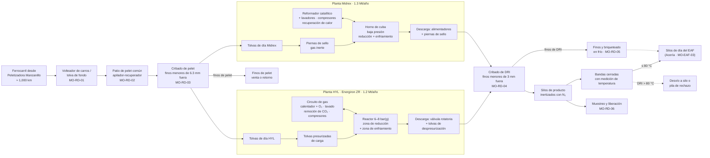
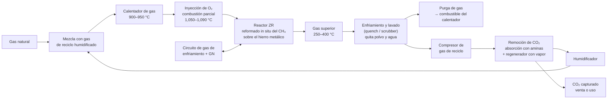
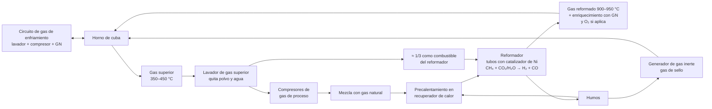

# Ficha Técnica de Reducción Directa — Plantas HYL y Midrex, Complejo Acería Norte

| Código | Versión | Estado | Custodio | Elaboró | Revisión técnica | Revisión de seguridad | Aprobó | Fecha | Próxima revisión |
|---|---|---|---|---|---|---|---|---|---|
| FT-RD-001 | 0.1 | **Borrador para validación** | Gerente de Reducción Directa (RC-01) + Ingenieros de Proceso (RC-09 HYL, RC-10 Midrex) · custodio técnico en C&D: experto-operativo-metalurgia | experto-operativo-metalurgia | Pendiente: RC-09, RC-10, RC-11 y licenciantes (OEM) | Pendiente: experto-seguridad-salud y RC-18 | **Pendiente: Director de C&D** (validación operativa previa con RC-01) | 2026-09-28 | Al validar con OEM o 2027-09-28 |

> **Mensaje clave.** El Complejo Acería Norte tiene **dos plantas de reducción directa** que convierten **≈ 3.55 Mt/año de pelet propio** en **2.5 Mt/año de DRI frío**: **HYL (Energiron ZR, 1.2 Mt/año)**, con reactor presurizado a 6–8 bar(g) y reformado del gas natural dentro del propio reactor, y **Midrex (1.3 Mt/año)**, con horno de cuba a baja presión y reformador catalítico externo. Las dos reciben pelet de un **patio común** y entregan DRI por **bandas cerradas directas** a los silos de día de la Acería, que carga el EAF con ≈ 95–100 % de DRI. Los riesgos dominantes son de **seguridad de procesos**: H₂ y CO a presión y a más de 900 °C, purgas con N₂ (asfixia), espacios confinados y autocalentamiento del DRI. La calidad que importa a la Acería es **metalización ≥ 93 %, carbono en rango y temperatura en banda ≤ 80 °C**.

> ⚠️ **Fuente única de datos técnicos de Reducción Directa.** Todos los manuales (MO-RD, MO-HYL, MO-MDX, MM-RD, MS-RD), las descripciones de puesto y los materiales de capacitación usan los valores de esta ficha. Son **valores típicos públicos de la industria** para plantas de este tamaño; **no son datos propietarios de los licenciantes** (Tenova HYL / Energiron, Midrex Technologies). Antes de usar cualquier manual en planta, Ingeniería de Proceso (RC-09, RC-10) los valida contra los manuales del licenciante y los datos reales de operación. Si un valor cambia, se cambia primero aquí. Las interfaces con la Peletizadora y la Acería se rigen por [CV-GASM-001](../00-cadena-de-valor/CV-GASM-001-cadena-de-valor.md) §4.1 y §4.2; si hay diferencia, manda CV-GASM-001.
>
> Marcas: **[Supuesto]** = valor de referencia para dimensionar · **[Validar con OEM]** = depende del licenciante o del diseño de la planta real.

## 1. Alcance del área de Reducción Directa

### 1.1 Diagrama de flujo general

### 1.2 Circuito de gas — Planta HYL (Energiron ZR)

### 1.3 Circuito de gas — Planta Midrex

### 1.4 Áreas, equipos y límites de batería

| Área | Equipos principales | Producto / función | Límite de batería [Supuesto] |
|---|---|---|---|
| Recepción de pelet | Vía de descarga, volteador rotatorio de carros o tolva de fondo, alimentadores, muestreador de recepción | Descargar ≈ 1 tren/día de pelet | Desde el enganche del tren en la vía interna del Complejo |
| Patio de pelet | Apilador-recuperador (o apilador + recuperador de rueda de cangilones), bandas de patio, equipo móvil | Inventario de ≥ 20 días de consumo | — |
| Cribado y alimentación | Cribas vibratorias (corte 6.3 mm), sistema de recubrimiento de apoyo si aplica, bandas y tolvas de día | Pelet limpio a cada planta | Hasta la tolva de día de cada planta |
| Planta HYL | Reactor ZR presurizado, tolvas de carga y descarga presurizadas, calentador de gas, inyección de O₂, lavador de gas superior, compresores de reciclo y de enfriamiento, remoción de CO₂ por aminas, generador de vapor, antorcha | DRI frío de alto carbono | Desde la tolva de día hasta la descarga de DRI |
| Planta Midrex | Horno de cuba, reformador catalítico, lavadores de gas superior y de enfriamiento, compresores de proceso y de enfriamiento, recuperador de calor, generador de gas inerte, chimenea | DRI frío | Desde la tolva de día hasta la descarga de DRI |
| Manejo de DRI | Cribas de producto (corte 3 mm), silos de producto con N₂, muestreador automático, bandas cerradas con medición de temperatura, desvío a rechazo | DRI a la Acería | **Hasta la descarga en la torre de transferencia de los silos de día del EAF** (los silos de día son de la Acería) |
| Finos y briquetas | Silos de finos, mezclador, prensa de briquetas en frío con aglutinante, curado | Briquetas de finos de DRI (si aplica) | — |
| Servicios del área | Torres de enfriamiento, clarificador y filtro de lodos, red de N₂ con reserva de N₂ líquido, estación de regulación de gas natural, aire de instrumentos | Servicios a las dos plantas | Desde las válvulas de entrada del área (gas natural, O₂, N₂, energía y agua los entrega el Complejo) |

## 2. Base de producción y balance de referencia

| Concepto | HYL | Midrex | Total | Fuente |
|---|---|---|---|---|
| Producción anual de DRI | 1.2 Mt | 1.3 Mt | 2.5 Mt | CV-GASM-001 §3 |
| Horas de operación | ≈ 8,000 h/año | ≈ 8,000 h/año | — | CV-GASM-001 §3 [Supuesto] |
| Producción horaria nominal | ≈ 150 t/h | ≈ 163 t/h | ≈ 313 t/h | Cálculo |
| Capacidad horaria de diseño | ≈ 165 t/h [Validar con OEM] | ≈ 180 t/h [Validar con OEM] | — | [Supuesto] |
| Consumo de pelet | ≈ 1.42 t/t DRI → 1.70 Mt/año (≈ 213 t/h) | ≈ 1.42 t/t DRI → 1.85 Mt/año (≈ 231 t/h) | ≈ 3.55 Mt/año | CV-GASM-001 §3 [Supuesto] |
| Finos de pelet retirados en cribado | 2–4 % del pelet recibido | 2–4 % | ≈ 70–140 kt/año | [Supuesto] |
| Finos de DRI (< 3 mm) retirados | 2–5 % del DRI | 2–5 % | ≈ 50–125 kt/año | [Supuesto] |

**Lectura:** 1.42 t de pelet por t de DRI resulta de ≈ 1.33 t teóricas (pérdida del oxígeno del óxido de hierro, pelet Fe ≈ 67.5 % → DRI Fe ≈ 90 %) más ≈ 6 % de pérdidas por finos de pelet, finos de DRI y polvo. Si el consumo real sube de 1.45 t/t, revisar la resistencia y los finos del pelet (CV-GASM-001 §4.1) antes que la operación del reactor.

## 3. Patio de pelet, cribado y alimentación (común a ambas plantas)

| Parámetro | Valor de referencia | Nota |
|---|---|---|
| Llegada de pelet | ≈ 9,700 t/día; ≈ 1 tren diario de ≈ 100 carros de ≈ 90–100 t [Supuesto] | Programa de trenes con la Peletizadora y el concesionario ferroviario |
| Descarga | Volteador rotatorio de 1–2 carros o tolva de fondo; ≈ 2,500–3,000 t/h [Supuesto] | MS-RD-10: maniobra de carros y peatones |
| Inventario en patio | ≥ 20 días de consumo (≈ 200,000 t) [Supuesto] | Pilas separadas por lote o por tipo de pelet si la Peletizadora envía más de uno |
| Especificación de pelet recibido | La de CV-GASM-001 §4.1: Fe ≥ 67.0 %; SiO₂ + Al₂O₃ ≤ 3.0 %; 9–16 mm ≥ 90 %; < 6.3 mm ≤ 3 %; CCS ≥ 250 kg/pelet; abrasión ≤ 5 %; volteo ≥ 94 %; humedad ≤ 2 % | Verificación por muestreo de recepción (§7.1) |
| Cribado antes del reactor | Corte a 6.3 mm; finos objetivo en la carga al reactor ≤ 1 % [Supuesto] | Finos en la carga → caída de presión, canalización del gas, pegado |
| Recubrimiento (coating) | Lo aplica la Peletizadora (cal, dolomita o bauxita). Aplicación de apoyo en RD solo si el licenciante lo pide [Validar con OEM] | Evita el pegado (clustering) a alta temperatura |
| Alimentación a tolvas de día | HYL ≈ 213 t/h; Midrex ≈ 231 t/h; capacidad de banda ≥ 1.3 × consumo [Supuesto] | Nivel de tolva de día: mínimo 4 h de consumo [Supuesto] |
| Humedad en tolva de día | ≤ 2 %; evitar pelet mojado en temporada de lluvias | La humedad consume energía en el reactor y en Midrex afecta el equilibrio del gas |

## 4. Planta HYL — Energiron ZR (1.2 Mt/año)

**Principio:** el gas natural se mezcla con el gas de reciclo, se calienta en el calentador de gas y se oxida parcialmente con O₂ para llegar a más de 1,050 °C. El **CH₄ se reforma dentro del reactor**, con el hierro metálico recién reducido como catalizador (por eso **no hay reformador externo**). El reactor trabaja **presurizado**, lo que aumenta la productividad por metro cúbico y permite la **remoción selectiva de CO₂** del gas de reciclo. El gas de enfriamiento con gas natural en la parte baja **carburiza** el DRI (carbono alto, mayormente como Fe₃C).

### 4.1 Parámetros de referencia

| Parámetro | Unidad | Objetivo | Rango normal | Alarma / límite | Acción si está fuera de rango | Dónde se mide | Marca |
|---|---|---|---|---|---|---|---|
| Presión en la parte superior del reactor | bar(g) | 6.5 | 6.0–8.0 | Alta: según ajuste de PSV y de la válvula de control a antorcha | Reducir alimentación de gas; ventear a antorcha por control; nunca bloquear la PSV | DCS (RS-08) | [Validar con OEM] |
| Temperatura del gas a la salida del calentador | °C | ≈ 930 | 900–950 | Alta > 960: bajar el fuego; disparo por piel de serpentín alta | Ajustar el quemador; revisar el flujo de gas de proceso | DCS | [Validar con OEM] |
| Temperatura del gas reductor a la entrada del reactor (después de O₂) | °C | ≈ 1,070 | 1,050–1,090 | Alta > 1,100: riesgo de pegado (clustering). Baja < 1,030: baja la metalización | Ajustar la relación O₂/gas; avisar a RC-09 | DCS, termopares de entrada | [Validar con OEM] |
| Relación O₂ / gas de proceso en la inyección | Nm³/Nm³ | Según curva del licenciante | — | Enclavamiento: corte de O₂ por bajo flujo de gas o por temperatura alta | 🛑 No restablecer el O₂ sin flujo de gas estable | DCS / SIS | [Validar con OEM] |
| Relación H₂/CO del gas reductor | — | ≈ 5 | 4–6 | Fuera de rango: revisar humidificación, CO₂ y gas natural | Ajuste por RC-09 | Analizador en línea | [Validar con OEM] |
| CH₄ en el gas reductor | % vol | ≈ 15 | 10–20 | Alto: baja la temperatura de reacción y sube el carbono | Ajuste por RC-09 | Analizador en línea | [Validar con OEM] |
| Calidad del gas reductor (H₂ + CO) / (H₂O + CO₂) | — | ≥ 10 | 8–14 | < 8: baja la metalización | Revisar lavador y remoción de CO₂ | Cálculo en DCS | [Supuesto] |
| CO₂ en el gas de reciclo después de la remoción | % vol | ≤ 2 | 1–3 | > 3: revisar la solución de aminas y el regenerador | Avisar a RS-10 y RC-09 | Analizador en línea | [Validar con OEM] |
| Temperatura del gas superior | °C | ≈ 300 | 250–400 | Alta: canalización o baja carga | Revisar la distribución del sólido y la carga | DCS | [Validar con OEM] |
| Caída de presión en el lecho | mbar | Según tendencia | — | Subida sostenida: finos o pegado | Revisar finos del pelet y temperatura de entrada | DCS | [Validar con OEM] |
| Inyección de O₂ | Nm³/t DRI | ≈ 60 | 50–70 | — | — | Totalizador | [Supuesto] |
| Temperatura del DRI a la descarga | °C | ≤ 50 | 40–60 | > 70 alarma; > 80 desvío a rechazo | Aumentar gas de enfriamiento; bajar el ritmo de descarga | Termopar / pirómetro en descarga | Coherente con CV-GASM-001 §4.2 |
| Metalización del DRI | % | ≥ 94 | 93–95 | < 93 alarma; < 92 retener | Ver §7.2 | Laboratorio (MO-RD-06) | CV-GASM-001 §4.2 |
| Carbono del DRI | % | ≈ 3.8 | 3.0–4.5 | Fuera de rango: ajustar gas natural en la zona de enfriamiento | Avisar a C-07 (Acería) si cambia > 0.5 % | Laboratorio | CV-GASM-001 §4.2 [Supuesto] |
| Productividad | t/h | 150 | 140–165 | < 135 sostenida: análisis de causa | — | Básculas de banda | [Supuesto] |

### 4.2 Consumos específicos de referencia

| Consumo | Valor de referencia | Marca |
|---|---|---|
| Gas natural (proceso + calentador), poder calorífico inferior | 9.5–10.5 GJ/t DRI (≈ 42,000–46,000 Nm³/h a 150 t/h) | [Supuesto] |
| Electricidad (sin producción de O₂) | 70–100 kWh/t DRI | [Supuesto] |
| Oxígeno | 50–70 Nm³/t DRI | [Supuesto] |
| Nitrógeno (purga de tolvas, sellos y paros) | 15–30 Nm³/t DRI | [Supuesto] |
| Agua de repuesto | 1.0–1.5 m³/t DRI | [Supuesto] |
| Pelet | ≈ 1.42 t/t DRI | CV-GASM-001 |
| CO₂ capturado (remoción selectiva) | Corriente de CO₂ de alta pureza, disponible para venta o uso | [Validar con OEM] |

### 4.3 Equipos críticos de HYL

| Equipo | Función | Condición para operar (verificación) | Proceso |
|---|---|---|---|
| Tolvas presurizadas de carga y de descarga | Pasar el sólido entre la atmósfera y el reactor a 6–8 bar(g) sin fuga de gas | Válvulas de sello herméticas; secuencia de presurización con gas inerte o de proceso completa; O₂ en tolva ≤ 1 % antes de abrir al reactor | MO-HYL-02, MO-HYL-07, MM-RD-06 |
| Calentador de gas de proceso | Calentar la mezcla de gas a 900–950 °C | Sistema de gestión de quemadores (BMS) probado; detectores de flama; temperatura de piel de serpentines en rango | MO-HYL-04, MM-RD-03 |
| Inyección de O₂ | Combustión parcial para llegar a > 1,050 °C | Tubería limpia para servicio de O₂; enclavamiento de corte por bajo flujo de gas | MO-HYL-04 |
| Enfriador y lavador de gas superior | Quitar polvo y condensar agua | Flujo de agua de lavado ≥ mínimo; nivel de sello hidráulico | MO-HYL-05 |
| Remoción de CO₂ (absorbedor + regenerador) | Quitar CO₂ del gas de reciclo | Concentración y temperatura de aminas en rango; vapor al regenerador | MO-HYL-05 |
| Compresores de reciclo y de enfriamiento | Recircular el gas | Vibración, temperatura de cojinetes y sellos en rango; protección anti-surge probada | MO-HYL-06, MM-RD-01 |
| Generador de vapor de recuperación | Vapor para el regenerador de aminas | Recipiente sujeto a presión con dictamen vigente (NOM-020-STPS) | MS-RD-08, MM-RD-04 |
| Antorcha / venteo | Quemar gas en paros y sobrepresiones | Piloto encendido; sello; flujo de purga | MO-HYL-08 |

## 5. Planta Midrex (1.3 Mt/año)

**Principio:** el gas superior del horno se lava; ≈ 2/3 se comprime, se mezcla con gas natural y pasa por los **tubos con catalizador de níquel del reformador**, donde el CH₄ reacciona con el CO₂ y el H₂O del gas de reciclo y produce H₂ y CO. El gas reformado (≈ 900–950 °C) entra al horno de cuba por el **anillo de gas (bustle)**. El otro ≈ 1/3 del gas superior es combustible del reformador. El horno trabaja a **baja presión** y se sella con **gas inerte** hecho con los humos del reformador. Una zona de enfriamiento con su propio circuito de gas enfría y carburiza el DRI.

### 5.1 Parámetros de referencia

| Parámetro | Unidad | Objetivo | Rango normal | Alarma / límite | Acción si está fuera de rango | Dónde se mide | Marca |
|---|---|---|---|---|---|---|---|
| Presión del gas de bustle | bar(g) | ≈ 1.5 | 1.0–2.0 | Alta: revisar caída de presión del lecho y la válvula de control | Reducir el flujo de gas de proceso | DCS (RS-11) | [Validar con OEM] |
| Presión en la parte superior del horno | bar(g) | ≈ 0.7 | 0.5–1.0 | Baja: riesgo de entrada de aire por los sellos | Verificar el gas de sello (ΔP sello–horno > 0) | DCS | [Validar con OEM] |
| ΔP gas de sello – horno (piernas de sello) | mbar | > 0 siempre | Según diseño | 🛑 ΔP ≤ 0: riesgo de fuga de gas reductor al exterior o de aire al horno | Subir el gas inerte; si no se recupera, reducir la carga | DCS | [Validar con OEM] |
| Temperatura del gas reformado a la salida del reformador | °C | ≈ 930 | 900–950 | Alta: riesgo en tubos | Ajustar el fuego del reformador | DCS | [Validar con OEM] |
| Temperatura del gas de bustle | °C | ≈ 950 (sin O₂) | 900–960; hasta 1,000–1,050 con inyección de O₂ | Alta > límite del licenciante: pegado | Ajustar O₂ y gas natural de enriquecimiento | DCS | [Validar con OEM] |
| Temperatura de piel de tubos del reformador | °C | Según diseño del tubo | — | Alta: alarma por termopares de piel y termografía de ronda | Reducir el fuego; revisar el reparto de gas en los tubos | DCS + ronda de RS-13 con pirómetro | [Validar con OEM] |
| Relación H₂/CO del gas de bustle | — | ≈ 1.6 | 1.5–1.7 | Fuera de rango: revisar la relación gas natural/gas de reciclo | Ajuste por RC-10 | Analizador en línea | [Validar con OEM] |
| Calidad del gas reductor (H₂ + CO) / (H₂O + CO₂) | — | ≥ 11 | 10–14 | < 10: baja la metalización | Revisar el reformador y el lavador | Cálculo en DCS | [Supuesto] |
| CH₄ en el gas de bustle | % vol | ≈ 4 | 3–6 | Alto: enfría el lecho | Ajustar el gas natural de enriquecimiento | Analizador en línea | [Validar con OEM] |
| O₂ en el gas inerte de sello | % vol | ≤ 0.5 | 0–1.0 | > 1.0 alarma; > 2.0 corte del gas inerte al horno | Ajustar la combustión del generador de gas inerte | Analizador en línea | [Validar con OEM] |
| Temperatura del aire de combustión precalentado | °C | ≈ 550 | 500–650 | Baja: más consumo de gas natural | Revisar el recuperador | DCS | [Supuesto] |
| Temperatura del gas superior | °C | ≈ 400 | 350–450 | Alta: canalización o baja carga | Revisar la distribución del sólido | DCS | [Validar con OEM] |
| Temperatura del DRI a la descarga | °C | ≤ 50 | 40–60 | > 70 alarma; > 80 desvío a rechazo | Aumentar el gas de enfriamiento; bajar el ritmo de descarga | Termopar / pirómetro | CV-GASM-001 §4.2 |
| Metalización del DRI | % | ≥ 94 | 93–95 | < 93 alarma; < 92 retener | Ver §7.2 | Laboratorio | CV-GASM-001 §4.2 |
| Carbono del DRI | % | ≈ 2.0 | 1.5–2.5 | Fuera de rango: ajustar el gas natural de la zona de enfriamiento | Avisar a C-07 (Acería) si cambia > 0.5 % | Laboratorio | CV-GASM-001 §4.2 [Supuesto] |
| Productividad | t/h | 163 | 150–180 | < 145 sostenida: análisis de causa | — | Básculas de banda | [Supuesto] |

### 5.2 Consumos específicos de referencia

| Consumo | Valor de referencia | Marca |
|---|---|---|
| Gas natural (proceso + reformador), poder calorífico inferior | 10.0–11.0 GJ/t DRI (≈ 48,000–53,000 Nm³/h a 163 t/h) | [Supuesto] |
| Electricidad | 90–120 kWh/t DRI | [Supuesto] |
| Oxígeno (inyección al gas de bustle, solo si la planta la tiene) | 0–30 Nm³/t DRI | [Validar con OEM] |
| Nitrógeno (purgas y paros; el sello usa gas inerte propio) | 5–15 Nm³/t DRI | [Supuesto] |
| Agua de repuesto | 1.2–1.8 m³/t DRI | [Supuesto] |
| Pelet | ≈ 1.42 t/t DRI | CV-GASM-001 |

### 5.3 Equipos críticos de Midrex

| Equipo | Función | Condición para operar (verificación) | Proceso |
|---|---|---|---|
| Horno de cuba y piernas de sello | Reducir y enfriar el pelet; evitar la fuga de gas | Gas de sello con ΔP positivo; O₂ en gas inerte ≤ 1 % | MO-MDX-02, MO-MDX-03 |
| Reformador (tubos con catalizador) | Producir H₂ + CO a partir de gas natural y gas de reciclo | BMS probado; temperatura de piel de tubos en rango; sin tubos calientes (manchas) en la termografía de ronda | MO-MDX-04, MM-RD-02 |
| Recuperador de calor | Precalentar aire de combustión y gas de alimentación | Temperaturas de humos y de aire en rango | MO-MDX-04 |
| Generador de gas inerte | Gas de sello para el horno | O₂ ≤ 1 %; flujo ≥ mínimo | MO-MDX-02 |
| Lavadores de gas superior y de enfriamiento | Quitar polvo y agua | Flujo de agua ≥ mínimo; sello hidráulico | MO-MDX-05 |
| Compresores de gas de proceso y de enfriamiento | Recircular el gas | Vibración, cojinetes, sellos, anti-surge | MO-MDX-05, MM-RD-01 |
| Alimentadores de descarga | Controlar el ritmo de descarga del DRI | Sin atascos; temperatura de producto en rango | MO-MDX-06 |

## 6. Comparativo HYL – Midrex (para capacitación)

| Tema | HYL (Energiron ZR) | Midrex | Lo que cambia para el operador |
|---|---|---|---|
| Presión del reactor / horno | 6–8 bar(g) | ≈ 0.5–2.0 bar(g) | En HYL, cada entrada o salida de sólido pasa por tolvas presurizadas: una secuencia mal hecha libera gas a presión |
| Generación del gas reductor | Reformado in situ en el reactor; calentador + O₂ | Reformador externo con catalizador de Ni | En Midrex, el reformador es el equipo de mayor riesgo de daño (tubos) y de mayor costo |
| Relación H₂/CO | ≈ 4–6 (más H₂) | ≈ 1.5–1.7 | Más H₂ = llama casi invisible y fugas difíciles de ver; detección de gas obligatoria en ronda |
| Remoción de CO₂ | Sí (aminas + regenerador con vapor) | No (el CO₂ se reforma) | HYL agrega el riesgo de aminas y de vapor (recipientes a presión) |
| Sellos | Válvulas de sello y tolvas presurizadas con N₂ / gas de proceso | Piernas de sello con gas inerte propio | Verificar O₂ ≤ 1 % en el gas de sello o de presurización |
| Carbono del DRI | 3.0–4.5 % | 1.5–2.5 % | La Acería ajusta la inyección de carbono según la mezcla (MO-EAF-05) |
| Uso de O₂ | Siempre (50–70 Nm³/t) | Opcional | En HYL, la inyección de O₂ tiene su propio enclavamiento |
| Hidrógeno como combustible futuro | Diseño apto para mezclas altas de H₂ [Validar con OEM] | Versiones aptas para mezclas de H₂ [Validar con OEM] | Base para la ruta de descarbonización del perfil de empresa |

## 7. Control de calidad del pelet recibido y del DRI

### 7.1 Pelet en recepción (MO-RD-01)

| Variable | Especificación (CV-GASM-001 §4.1) | Método | Frecuencia [Supuesto] | Acción si falla |
|---|---|---|---|---|
| Fe total, SiO₂, Al₂O₃, CaO, MgO | Fe ≥ 67.0 %; SiO₂ + Al₂O₃ ≤ 3.0 % | Fluorescencia de rayos X (XRF) / vía húmeda | Compósito por tren | Segregar la pila, avisar a la Peletizadora y a RC-11 |
| Granulometría | 9–16 mm ≥ 90 %; < 6.3 mm ≤ 3 % | Cribado de laboratorio | Por tren | Aumentar el cribado; reclamo a la Peletizadora |
| Resistencia a la compresión (CCS) | ≥ 250 kg/pelet | Prensa de laboratorio (60 pelets) | Por tren | Reclamo; vigilar finos y caída de presión en el reactor |
| Abrasión y volteo | Abrasión ≤ 5 %; volteo ≥ 94 % | Tambor de volteo | Por tren | Igual que CCS |
| Humedad | ≤ 2 % | Estufa | Por tren | Apilar para drenar; no alimentar pelet mojado |
| Reducibilidad, hinchamiento y pegado | Según el licenciante | Pruebas de reducción de laboratorio | Mensual o por cambio de mezcla | Ajustar recubrimiento o práctica [Validar con OEM] |

### 7.2 DRI a la Acería (MO-RD-06)

| Variable crítica | Especificación | Alarma / límite | Método | Frecuencia [Supuesto] | Acción | Defecto si falla (en la Acería) |
|---|---|---|---|---|---|---|
| Metalización (Fe metálico / Fe total) | ≥ 93 % (objetivo 94 %) | 92–93 %: alarma. **< 92 %: retener** | Fe metálico por titulación (cloruro férrico o bromo-metanol) + Fe total | Compósito por hora de cada planta | < 92 %: desviar a silo o pila de rechazo o mezclar solo con autorización de RC-11 y aviso a C-07 (Acería) | Más energía y carbono en el EAF, más FeO en escoria, menor rendimiento |
| Carbono total | HYL 3.0–4.5 %; Midrex 1.5–2.5 % | Cambio > 0.5 % contra el turno anterior: avisar | Combustión e infrarrojo | Por hora | Avisar a C-07 para ajustar la inyección de C | Descontrol de escoria espumosa y del C al vaciado |
| Fe total | HYL ≈ 88–91 %; Midrex ≈ 90–92 % | — | Titulación / XRF | Por turno | Informativo | — |
| Ganga (SiO₂ + Al₂O₃ + CaO + MgO) | ≈ 5–6.5 % (según pelet) | > 6.5 %: avisar | XRF | Por turno | Avisar a C-07 (cal y volumen de escoria) | Más escoria y más energía |
| S / P | S ≤ 0.010 %; P ≤ 0.030 % | Fuera: avisar | Combustión (S), XRF (P) | Por turno | Avisar a C-07 y a C-09 | Desulfuración o desfosforación extra |
| Tamaño y finos | 4–20 mm; finos < 3 mm ≤ 5 % (objetivo ≤ 3 %) | > 5 %: revisar cribas | Cribado de laboratorio | Por turno | Revisar las cribas de producto | Finos en el 5.º agujero: pérdida por humos y reoxidación |
| Temperatura en banda | ≤ 80 °C (objetivo ≤ 50 °C) | > 70 °C alarma; **> 80 °C desvío automático** | Escáner o pirómetro infrarrojo en banda | Continuo | Desvío a rechazo; revisar la zona de enfriamiento | Riesgo de incendio en banda y en silo de día |
| Humedad | Seco (≤ 0.5 %) | Cualquier contacto con agua: retener | Estufa / inspección | Por turno y por evento | Retener; no enviar a la Acería DRI mojado | ⚠️ Generación de H₂ y riesgo de explosión en el EAF (CV-GASM-001 §5) |

**Muestreo:** muestreador automático en la banda de producto de cada planta; incrementos cada 15–30 min; compósito por hora para metalización y carbono y por turno para la química completa [Supuesto]. Reporte de calidad por lote a la Acería en cada entrega de turno. **Métodos analíticos:** verificar las normas ISO aplicables con RC-11 y el laboratorio [Validar].

## 8. Servicios

| Servicio | Uso | Referencia | Condición crítica | Marca |
|---|---|---|---|---|
| Gas natural | Materia prima del gas reductor y combustible | ≈ 90,000–100,000 Nm³/h para las dos plantas; estación de regulación y medición del área; calidad según la NOM de especificaciones del gas natural (verificar con Jurídico / Energía) | Válvula de corte de emergencia del área (ESD) probada; azufre bajo para no envenenar el catalizador de Midrex | [Supuesto] |
| Oxígeno | Inyección en HYL (y en Midrex si aplica) | ≈ 7,500–10,500 Nm³/h en HYL; de la planta de separación de aire del Complejo (compartida con la Acería) | Tubería limpia para O₂; corte por enclavamiento | [Supuesto] |
| Nitrógeno | Purgas, inertización de silos, tolvas presurizadas, paros | Red del Complejo + **reserva de N₂ líquido con vaporizadores para purgar las dos plantas al menos 2 veces el volumen de gas del sistema** (≈ ≥ 8 h) | 🛑 Sin N₂ disponible no se arranca ni se para en forma controlada. Presión baja del cabezal = alarma prioritaria | [Supuesto] [Validar con OEM] |
| Electricidad | Compresores (varios MW), bombas, bandas, DCS | ≈ 12 MW medios en HYL y ≈ 18 MW en Midrex; alimentación desde la subestación principal (Mantenimiento Central) | UPS del DCS/SIS; paro seguro ante apagón | [Supuesto] |
| Agua de enfriamiento (circuito limpio) | Compresores, equipos, intercambiadores | Torres de enfriamiento del área | Pérdida de agua = disparo de compresores | [Supuesto] |
| Agua de proceso (circuito sucio) | Lavadores de gas superior y de enfriamiento | Clarificador, filtro de lodos (lodos con finos de hierro) | Agua de repuesto 1.0–1.8 m³/t; zona semiárida: reúso obligatorio | [Supuesto] |
| Vapor | Regenerador de aminas (HYL) | Generador de vapor de recuperación | Recipiente sujeto a presión (NOM-020-STPS) | [Validar con OEM] |
| Aire de instrumentos | Válvulas de control y de sello | Punto de rocío ≤ −40 °C [Supuesto] | Pérdida de aire = válvulas a posición segura | [Supuesto] |

## 9. Alarmas, enclavamientos y límites seguros de operación

Estos límites son **controles críticos de seguridad de procesos**. Ningún manual ni instrucción puede debilitarlos; cualquier puenteo (bypass) de un enclavamiento requiere el permiso de gestión del cambio temporal, firmado por RC-02/RC-03, RC-18 y RC-19. Valores de ajuste finales: **[Validar con OEM y con el estudio de riesgos (HAZOP) y la asignación de SIL]**.

| Condición | Límite de referencia | Respuesta automática | Respuesta del operador |
|---|---|---|---|
| Purga antes de introducir gas combustible | O₂ < 1 % vol en todos los puntos de muestreo del sistema | Permisivo de arranque del SIS | Verificar con analizador en línea **y** con analizador portátil; registrar puntos y lecturas (MO-HYL-01, MO-MDX-01) |
| Purga antes de abrir un equipo al aire o de entrar | Combustibles (H₂ + CO + CH₄) < 1 % vol, luego ventilación con aire hasta O₂ 19.5–23.5 %, CO ≤ 25 ppm y < 10 % del límite inferior de explosividad (LIE) | — | Permiso de espacio confinado (MS-RD-04); criterios a verificar con SSO y NOM-033-STPS |
| Detector fijo de CO en área | 25 ppm alarma 1; 50 ppm alarma 2 | Alarma sonora y visual | Alarma 2: evacuar el área local y aislar la fuente. Alinear el umbral con la decisión pendiente de la Acería (50 o 200 ppm) |
| Detector fijo de gas combustible (H₂ / CH₄) | 10 % LIE alarma; 20 % LIE alarma alta | 20 % LIE: corte automático de la sección si el SIS lo define | Evacuar, aislar, no usar fuentes de ignición |
| O₂ en gas de sello o en tolvas presurizadas | > 1 % alarma; > 2 % corte | Corte del gas de sello / bloqueo de la secuencia de tolvas | No abrir la tolva al reactor hasta O₂ ≤ 1 % |
| Pérdida de flama en calentador (HYL) o reformador (Midrex) | Detector de flama | Disparo del combustible por el BMS | Purga del hogar antes de reencender (tiempo según el BMS) |
| Presión alta en reactor HYL | Por encima del rango de control | Apertura de la válvula de control a antorcha; PSV como última protección | Reducir el gas; nunca aislar una PSV en servicio |
| Temperatura del gas reductor alta | HYL > 1,100 °C; Midrex > límite del licenciante | Corte de O₂ (si aplica) | Bajar el fuego o el O₂; vigilar pegado |
| Disparo de compresor de gas de reciclo o de proceso | Vibración, temperatura de cojinetes, sellos, surge | Paro del compresor y secuencia de paro seguro de la planta | Seguir MO-HYL-08 / MO-MDX-07; asegurar N₂ |
| Presión baja de N₂ en cabezal | Por debajo del mínimo de purga | Alarma prioritaria; arranque de vaporizadores de reserva | No iniciar arranques ni cambios de tolvas; avisar a RC-05 |
| Temperatura del DRI en banda | > 70 °C alarma; > 80 °C desvío | Desvío automático a rechazo | Revisar la zona de enfriamiento; no mojar el DRI |
| Temperatura en silo de producto | > 65 °C alarma; > 80 °C inyección de N₂ adicional [Supuesto] | Inyección de N₂ | Vigilar CO en el espacio superior del silo (signo de reoxidación); vaciado controlado según MS-RD-05 |

## 10. Indicadores clave (KPIs)

| KPI | HYL | Midrex | Frecuencia | Dueño |
|---|---|---|---|---|
| Producción de DRI | ≥ 1.2 Mt/año; ≈ 150 t/h | ≥ 1.3 Mt/año; ≈ 163 t/h | Diaria | RC-02 / RC-03 |
| Horas de operación | ≥ 8,000 h/año | ≥ 8,000 h/año | Mensual | RC-02 / RC-03 |
| Metalización media | ≥ 94 % | ≥ 94 % | Diaria | RC-11 |
| DRI < 92 % de metalización enviado a la Acería | 0 t | 0 t | Diaria | RC-11 |
| DRI enviado > 80 °C | 0 eventos | 0 eventos | Continuo | RC-08 |
| Gas natural específico | 9.5–10.5 GJ/t | 10.0–11.0 GJ/t | Mensual | RC-09 / RC-10 |
| Electricidad específica | 70–100 kWh/t | 90–120 kWh/t | Mensual | RC-09 / RC-10 |
| Consumo de pelet | ≤ 1.42 t/t | ≤ 1.42 t/t | Mensual | RC-11 |
| Finos de DRI generados | ≤ 5 % | ≤ 5 % | Semanal | RC-08 |
| Paros no programados | Meta a definir con la línea base [Supuesto] | Igual | Mensual | RC-04 |
| Eventos de seguridad de procesos (pérdida de contención, clasificación Tier 1 / Tier 2 del estándar API RP 754) | Tier 1 = 0 | Tier 1 = 0 | Mensual | RC-18 |
| Pruebas de funciones del SIS al día | 100 % | 100 % | Mensual | RC-19 |

## 11. Dotación de referencia [Supuesto]

Detalle en [ORG-RD-001](01-organizacion/organigrama-reduccion-directa.md) y códigos en [CAT-RD-001](00-catalogo-procesos-y-roles.md).

| Área | Confianza | Sindicalizados | Total |
|---|---|---|---|
| Gerencia y staff (calidad, seguridad de procesos) | 6 | — | 6 |
| Jefatura de turno | 4 | — | 4 |
| Planta HYL (operación) | 7 | 37 | 44 |
| Planta Midrex (operación) | 7 | 37 | 44 |
| Manejo de materiales y servicios (patio de pelet, bandas de DRI, briquetas, agua, N₂) | 4 | 111 | 115 |
| Laboratorio de RD | (RC-11) | 14 | 14 |
| Mantenimiento (mecánico, rotativo, E&I, soldadura, refractario, bandas, planeación, confiabilidad, integridad, control y SIS) | 19 | 162 | 181 |
| **Total Reducción Directa** | **47** | **361** | **408** |

Operación continua 24/7 en **rol 4x4 de 12 h** con 4 cuadrillas. En cada turno hay **5 mandos de confianza y 53 sindicalizados** en planta. Los 408 están dentro de las 3,900 personas del Complejo Acería Norte (perfil de empresa §2) y se comparan con la cartera de TD-C-ACN-01 "Área DRI" (≈ 450). Paros mayores (cambio de tubos o de catalizador, campañas de refractario) usan contratistas REPSE.

## 12. Coherencia con otros documentos (observaciones del custodio)

| Documento | Observación | Acción propuesta |
|---|---|---|
| CV-GASM-001 §4.2 | Coincide: metalización ≥ 93 %, C HYL 3.0–4.5 % y Midrex 1.5–2.5 %, 4–20 mm, finos ≤ 5 %, banda ≤ 80 °C | Ninguna |
| FT-ACE-001 v0.3 §2 | Aún dice "60 % DRI/HBI + 40 % chatarra" y "DRI caliente 500–650 °C, hasta 5.0 t/min" | La Acería emite FT-ACE-001 v0.4 alineada a CV-GASM-001: ≈ 95–100 % DRI **frío** por banda; retirar el DRI caliente (no hay transporte en caliente en el diseño D-010) |
| ORG-ACE-001 §4 (interfaz "Planta DRI") | Menciona "temperatura del DRI caliente (500–650 °C)" y una sola planta | Actualizar a "Plantas HYL y Midrex", DRI ≤ 80 °C, contraparte RC-05 / RC-08 / RC-11 |
| Perfil de empresa §2 | Describe "DRI plant (hydrogen-ready natural gas reactor)" en singular | Actualizar a dos plantas (HYL y Midrex) cuando se revise el perfil |
| Estructura de C&D (TD-C-ACN-01, ≈ 450) | La dotación de esta ficha es 408 [Supuesto] | Conciliar con RH del Complejo |

## 13. Revisión cruzada requerida

- **experto-seguridad-salud:** §9 completo (umbrales de CO y LIE, criterios de purga y de entrada, N₂ de reserva), MS-RD-01 a MS-RD-10, NOM-020, NOM-033, NOM-005 y NOM-028-STPS (seguridad de procesos con sustancias químicas peligrosas; verificar aplicabilidad con Jurídico / SSO).
- **experto-documentacion-mejora:** alta de FT-RD-001 en el control documental y liga con CV-GASM-001.
- **experto-relaciones-laborales:** dotación sindicalizada y categorías nuevas (vía CAT-RD-001 y ORG-RD-001).
- **Ingeniería de Proceso RD (RC-09, RC-10) y licenciantes:** todos los valores marcados.

## 14. Control de cambios

| Versión | Fecha | Cambio | Elaboró |
|---|---|---|---|
| 0.1 | 2026-09-28 | Emisión inicial por la decisión D-010: alcance y diagramas de flujo, parámetros de HYL y Midrex por separado, calidad del pelet y del DRI, servicios, límites seguros, KPIs y dotación | experto-operativo-metalurgia |
