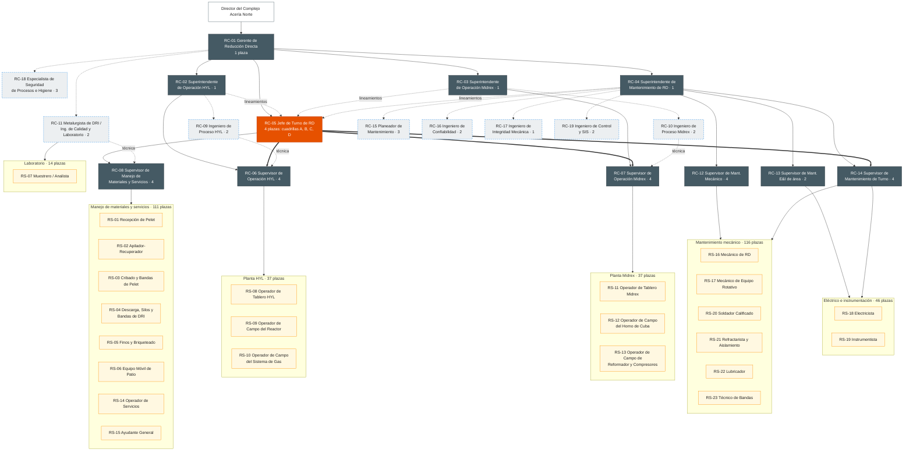
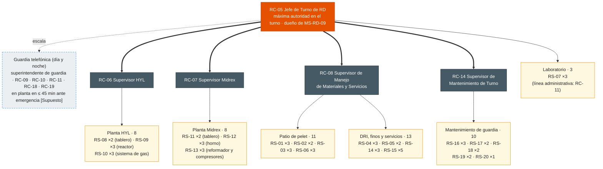

# Organigrama de Reducción Directa (Plantas HYL y Midrex) — Complejo Acería Norte

| Código | Versión | Estado | Área | Elaboró | Revisión técnica | Revisión de seguridad | Revisión laboral | Revisión documental | Aprobó | Fecha | Próxima revisión |
|---|---|---|---|---|---|---|---|---|---|---|---|
| ORG-RD-001 | 0.1 | **Borrador para validación** | Reducción Directa | experto-operativo-metalurgia | Pendiente: RC-01 / RC-02 / RC-03 | Pendiente: experto-seguridad-salud (guardia y respuesta a emergencias) | Pendiente: experto-relaciones-laborales (categorías, mando, jornada 4x4) | Pendiente: experto-documentacion-mejora | **Pendiente: Director de C&D** (único que aprueba; validación operativa previa con RC-01) | 2026-09-28 | 2027-09-28 |

> **Mensaje clave.** Reducción Directa tiene **408 plazas [Supuesto]**: **47 de confianza** en 19 roles (RC-01 a RC-19) y **361 sindicalizadas** en 23 categorías (RS-01 a RS-23). Hay **dos superintendencias de operación, una por tecnología (HYL y Midrex)**, una de **Mantenimiento** y una **jefatura de turno** (4 RC-05) con mando sobre las dos plantas y el manejo de materiales en su cuadrilla. En cada turno de 12 h hay **5 mandos de confianza y 53 sindicalizados** en planta: 8 en HYL, 8 en Midrex, 24 en manejo de materiales y servicios, 3 en laboratorio y 10 de mantenimiento de guardia. **El mando sobre el personal sindicalizado es solo de roles de confianza** (LFT art. 9): los operadores de tablero RS-08 y RS-11 coordinan técnicamente, sin funciones de mando (verificar con Jurídico Laboral).

**Fuentes:** [FT-RD-001](../00-ficha-tecnica-reduccion-directa.md) §11, [CAT-RD-001](../00-catalogo-procesos-y-roles.md) §1, [CV-GASM-001](../../00-cadena-de-valor/CV-GASM-001-cadena-de-valor.md), perfil de empresa (`01-company-profile/company-profile.md` §2: Complejo Acería Norte, 3,900 personas) y modelo de la Acería ([ORG-ACE-001](../../01-steelmaking/01-organizacion/organigrama-acería.md)). Todas las cifras de plazas son **[Supuesto]** hasta conciliarlas con Recursos Humanos del Complejo.

## 1. Organigrama completo

### 1.1 Estructura de mando (mermaid)

Convenciones: línea sólida = línea de mando · línea punteada = staff o línea técnica · línea gruesa = **mando operativo en turno** de RC-05 · cifras = plazas.

**Cómo leerlo:**
- **RC-05 reporta a RC-01** porque su turno cruza las dos plantas y el manejo de materiales. Recibe lineamientos técnicos de RC-02, RC-03 y RC-04 y **en su cuadrilla manda sobre todos los supervisores** (línea gruesa). Es el mismo modelo que la Acería (opción A de la Decisión 1 de DP-ACE-C).
- **RC-06 y RC-07 reportan en línea sólida a su superintendente** (una tecnología cada uno) y en turno al RC-05.
- **RC-08 reporta en línea sólida al RC-05 de su cuadrilla**: el manejo de materiales no tiene superintendencia propia. Uno de los cuatro RC-05 se designa como **coordinador administrativo de manejo de materiales** (presupuesto, contratistas de patio, programa de trenes) [Supuesto]. RC-11 da la línea técnica de calidad.
- **RC-14 (mantenimiento de turno)** reporta en línea sólida a RC-04 y en turno al RC-05. Es la respuesta de mantenimiento a un disparo de compresor, a una fuga o a una banda detenida de noche.
- **RC-19 (DCS/SIS)** reporta a RC-04 con línea técnica a Ingeniería y Control del Complejo. **Independencia del SIS:** los ajustes y puenteos de enclavamientos los autoriza RC-19 con RC-18, no la operación.
- RC-11 y RC-18 son staff del Gerente: **RC-11 puede retener DRI fuera de especificación** y **RC-18 puede detener el trabajo**. Los RS-07 dependen administrativamente de RC-11 para mantener la independencia de Calidad; en turno están bajo el mando de RC-05.

### 1.2 Plantilla por área [Supuesto]

| Área | Confianza (plazas) | Sindicalizados | Códigos RS (plazas) |
|---|---|---|---|
| Gerencia y staff | RC-01 ×1, RC-11 ×2, RC-18 ×3 = **6** | — | — |
| Jefatura de turno | RC-05 ×4 = **4** | — | — |
| Planta HYL | RC-02 ×1, RC-06 ×4, RC-09 ×2 = **7** | **37** | RS-08 (9), RS-09 (14), RS-10 (14) |
| Planta Midrex | RC-03 ×1, RC-07 ×4, RC-10 ×2 = **7** | **37** | RS-11 (9), RS-12 (14), RS-13 (14) |
| Manejo de materiales y servicios | RC-08 ×4 = **4** | **111** | RS-01 (14), RS-02 (9), RS-03 (14), RS-04 (14), RS-05 (9), RS-06 (14), RS-14 (14), RS-15 (23) |
| Laboratorio | (RC-11) | **14** | RS-07 (14) |
| Mantenimiento mecánico | RC-12 ×4 | **116** | RS-16 (47), RS-17 (24), RS-20 (14), RS-21 (13), RS-22 (7), RS-23 (11) |
| Eléctrico e instrumentación | RC-13 ×2 | **46** | RS-18 (22), RS-19 (24) |
| Mantenimiento: jefatura, turno, planeación, confiabilidad, integridad, control/SIS | RC-04 ×1, RC-14 ×4, RC-15 ×3, RC-16 ×2, RC-17 ×1, RC-19 ×2 | — | — |
| **Subtotal mantenimiento** | **19** (RC-04 1, RC-12 4, RC-13 2, RC-14 4, RC-15 3, RC-16 2, RC-17 1, RC-19 2) | **162** | |
| **Total Reducción Directa** | **47** (6 + 4 + 7 + 7 + 4 + 19) | **361** (37 + 37 + 111 + 14 + 162) | **408** |

**Contexto del Complejo [Supuesto]:** Acería 1,023 (ORG-ACE-001) + Reducción Directa 408 + laminación, mantenimiento central y áreas de soporte ≈ 2,470 = ≈ 3,900 (perfil de empresa). La cartera de C&D de TD-C-ACN-01 ("Área DRI, gases e hidrógeno") dimensiona ≈ 450; la diferencia (≈ 42) puede corresponder a la planta de separación de aire, a la estación de gas o a personal compartido. **Conciliar con RH del Complejo.**

## 2. Organigrama de un turno típico (una cuadrilla de 12 h)

Rol 4x4: cada cuadrilla (A, B, C, D) trabaja 4 turnos de 12 h (de día o de noche) y descansa 4. Este es quién está en planta en **un** turno.

| Grupo en planta (por cuadrilla) | Confianza | Sindicalizados por turno |
|---|---|---|
| Jefatura | RC-05 ×1 | — |
| Planta HYL | RC-06 ×1 | 8 |
| Planta Midrex | RC-07 ×1 | 8 |
| Manejo de materiales y servicios (patio de pelet, bandas de DRI, finos, agua y N₂) | RC-08 ×1 | 24 |
| Laboratorio | (RC-11 de guardia) | 3 |
| Mantenimiento de guardia 24/7 | RC-14 ×1 | 10 |
| **Total por turno** | **5** | **53** (≈ 58 personas en planta) |

**Criterios de la dotación por turno:**
- **Tablero con 2 operadores por planta.** Uno opera el DCS y el otro cubre alarmas, permisos y relevos para comer. El tablero **nunca queda solo durante un arranque, un paro o una emergencia**.
- **Campo con 3 + 3 por planta.** Rondas con detector de gas (H₂, CO, O₂) y **trabajo en pareja** en áreas de gas (política de no trabajar solo en zonas con H₂/CO) [Supuesto, validar con SSO].
- **Mantenimiento de guardia de 10.** Un disparo de compresor, una fuga en brida o una banda detenida se atienden sin esperar a la guardia telefónica.

**Cálculo de plazas sindicalizadas:** 53 puestos continuos × factor 4.5 (4 cuadrillas + relevo por ≈ 11 % de ausencias, igual que la Acería) ≈ 245 plazas + 106 puestos de día de mantenimiento × 1.1 ≈ 116 plazas = **361** [Supuesto].

**Jornada 4x4 de 12 h — nota laboral:** el turno de 12 h rebasa las jornadas máximas de los arts. 60–61 LFT y el 4x4 promedia ≈ 42 h/semana; solo se sostiene si el CCT lo pacta como jornada distribuida (art. 59) con pago del tiempo que exceda la jornada legal (arts. 66–68). Una reforma a 40 h/semana podría subir el factor de relevo a ≈ 4.7 (≈ +11 plazas sindicalizadas en RD) o exigir otro rol; el efecto aplica también a los 20 mandos de confianza en turno (RC-05, RC-06, RC-07, RC-08, RC-14). **Verificar con Jurídico Laboral** (misma nota que ORG-ACE-001).

**Horario del turno** [Supuesto]: relevo 07:00 y 19:00, igual que la Acería para facilitar la llamada de turno a turno del DRI. Entrega–recepción de RC-05 a RC-05 y de tablero a tablero 15 min antes, con la **bitácora de estado de enclavamientos, puenteos activos, permisos abiertos y aislamientos con N₂**. Junta diaria de producción a las 07:30 (RC-01, superintendentes, RC-05 saliente y entrante, RC-11).

## 3. Tramos de control

| Rol | Reportes directos | Personas a cargo (indirectas) | Lectura |
|---|---|---|---|
| RC-01 Gerente | 12 formales: RC-02, RC-03, RC-04, RC-05 ×4, RC-11 ×2, RC-18 ×3 | 408 | **7 efectivos** si el líder de RC-11 y el de RC-18 coordinan a sus pares. Adecuado |
| RC-02 Supt. HYL | 6: RC-06 ×4, RC-09 ×2 | 37 | Bajo en número, pero con la carga técnica de un proceso a presión. Adecuado |
| RC-03 Supt. Midrex | 6: RC-07 ×4, RC-10 ×2 | 37 | Igual que HYL |
| RC-04 Supt. Mantenimiento | 18: RC-12 ×4, RC-13 ×2, RC-14 ×4, RC-15 ×3, RC-16 ×2, RC-17 ×1, RC-19 ×2 | 162 | **Alto.** Igual que la Acería (C-10 con 17). Mitigación: los 4 RC-14 están en turno y se ven en la junta diaria; un líder de ingeniería (RC-16 o RC-17) puede coordinar RC-15, RC-16, RC-17 y RC-19 (bajaría a 11). Ver Decisión 3 |
| RC-05 Jefe de Turno | Mando en turno de 4 supervisores + línea sólida de RC-08 | 53 por turno | Adecuado |
| RC-06 / RC-07 | — | 8 / 8 por turno | **Bajo contra la referencia de 15–25** [Supuesto]; se justifica por seguridad de procesos (arranques, paros, purgas y permisos de gas exigen un mando en cada planta). Alternativa en la Decisión 2 |
| RC-08 Manejo de materiales | — | 24 por turno + transportistas y contratistas de patio | En el rango alto; se apoya en la coordinación técnica de RS-01 y RS-04, **sin delegarles mando** (art. 9) |
| RC-12 (×4) | — | ≈ 20 de día cada uno (80 puestos de día mecánicos) | Adecuado |
| RC-13 (×2) | — | ≈ 13 de día cada uno | Adecuado |
| RC-14 (×4) | — | 10 por turno en 5 oficios | Adecuado |
| RC-11 (×2) | — | ≈ 7 RS-07 cada uno (línea administrativa) | Adecuado |

## 4. Interfaces

| Interfaz | Qué se intercambia | Roles de RD | Contraparte | Mecanismo y frecuencia |
|---|---|---|---|---|
| **Peletizadora Manzanillo** | Calidad del pelet (CV-GASM-001 §4.1), programa de trenes, reclamos por lote | RC-01, RC-11, RC-08 | Gerencia y Calidad de la Peletizadora | Programa semanal de embarques; reporte por tren; reclamo formal con 8D |
| **Concesionario ferroviario** | Llegada, maniobra y retiro de carros; seguridad en vía | RC-08, RC-05 | Jefe de terminal del concesionario | Diario; reglas de maniobra en MS-RD-10 |
| **Acería (EAF)** | DRI por banda: toneladas, metalización, carbono, temperatura, finos; paros coordinados; nivel de silos de día | RC-05, RC-08, RC-11, RC-02, RC-03 | C-04 (Jefe de Turno de Acería), C-07 (Ingeniero de Proceso EAF/LF), C-02 | Llamada de turno a turno; reporte de calidad por lote; junta diaria. **Punto de entrega: descarga en la torre de transferencia de los silos de día** |
| **Energía del Complejo** | Gas natural, electricidad (demanda de compresores), O₂ y N₂ de la planta de separación de aire, reserva de N₂ líquido | RC-01, RC-02, RC-03, RC-05 | Energía del Complejo | Programa diario de gas y O₂; aviso inmediato ante baja presión de N₂ o de gas |
| **Mantenimiento Central** | Subestación principal, torres centrales, taller central, CMMS, paros mayores (tubos, catalizador) | RC-04, RC-13, RC-15, RC-17 | Gerencia de Mantenimiento Central / Confiabilidad | Plan semanal integrado; paros mayores anuales |
| **SSO del Complejo** | Seguridad de procesos (HAZOP, gestión del cambio, SIS), permisos, brigadas, higiene (CO, ruido, polvo) | RC-18, RC-19, RC-05 | Gerencia de SSO del Complejo | Comité mensual; simulacros de fuga de gas y de pérdida de N₂ |
| **Calidad del Complejo** | Métodos de laboratorio, liberación del DRI, auditorías ISO 9001 | RC-11 | Gerencia de Calidad | Revisión mensual |
| **C&D (Academia GASM)** | Descripciones de puesto, matriz de competencias, certificación TD-P07, simuladores de operación, Escuela de Supervisores | RC-01, RC-02, RC-03, RC-04, supervisores | TD-S04, **TD-C-ACN-01 (DRI, gases e hidrógeno)**, TD-C-ACN-05 (mantenimiento), TD-C-ACN-06 (contratistas REPSE), TD-C-ACN-08 (simuladores y Escuela de Supervisores), TD-10 (Academia de Acería) | Plan anual; revisión mensual de certificaciones |
| **Relaciones Laborales** | Categorías RS nuevas, escalafón, DC-3/DC-4, CMCAP | RC-01, superintendentes, RC-05 | Relaciones Laborales del Complejo; delegados sindicales | Mensual; según evento |

## 5. Implicaciones para C&D

| Población | Plazas | Programa | Nota |
|---|---|---|---|
| Jefes de turno y supervisores (RC-05, RC-06, RC-07, RC-08, RC-12, RC-13, RC-14) | 26 | **L-1 "Líder de Turno"** | 1 cohorte con la Acería; módulo propio de **seguridad de procesos para mandos** |
| Gerente y superintendentes (RC-01 a RC-04) | 4 | **L-2 "Líder de Líderes"** | RC-05 como sucesores |
| Ingenieros y especialistas (RC-09, RC-10, RC-11, RC-15, RC-16, RC-17, RC-18, RC-19) | 17 | Rutas técnicas de DRI, seguridad de procesos (HAZOP, SIS), integridad mecánica | Posiciones críticas: RC-02, RC-03, RC-09, RC-10, RC-17, RC-19 [Supuesto] |
| Operadores de tablero (RS-08, RS-11) | 18 | Ruta de tablero con **simulador de operación (OTS)** del licenciante; certificación por planta | Sin simulador, el aprendizaje de arranques y paros depende de los pocos eventos reales al año |
| Operadores de campo, de manejo de materiales, servicios y laboratorio | 181 | Ruta de gas, N₂, espacios confinados, DRI y bandas; certificación TD-P07 por proceso | Meta de TD-C-ACN-01: certificación en gas e hidrógeno 100 % |
| Mantenimiento (RS-16 a RS-23) | 162 | Rutas de equipo rotativo, bridas y apriete controlado, soldadura de presión, SIS | Legado Experto (TD-C-ACN-05) |

## 6. Revisión cruzada requerida

- **experto-relaciones-laborales:** mando de RC-05 y RC-08; coordinación técnica sin mando de RS-08/RS-11; categorías nuevas; nota de jornada 4x4.
- **experto-seguridad-salud:** guardia telefónica (≤ 45 min), política de trabajo en pareja en áreas de gas, brigada de rescate en espacios confinados del área.
- **experto-liderazgo-cambio:** doble línea (superintendente por tecnología / jefe de turno común).
- **experto-documentacion-mejora:** alta de ORG-RD-001 y liga con CAT-RD-001.

## 7. Decisión requerida del Director

| # | Tema | Opciones | Recomendación | Riesgos | Costo | Fecha límite |
|---|---|---|---|---|---|---|
| 1 | Dotación de referencia | **A.** Usar 408 [Supuesto] como base de la segunda ola y conciliar con RH del Complejo en 30 días. **B.** Redimensionar a ≈ 450 para coincidir con TD-C-ACN-01. **C.** Esperar la plantilla real antes de escribir descripciones | **A** | B: inflar cupos de formación sin sustento. C: retrasa la segunda ola | Ninguno | 2026-10-09 |
| 2 | Supervisión por planta en turno | **A.** Un supervisor por planta (RC-06, RC-07) por turno. **B.** Un solo supervisor de operación para HYL y Midrex por turno (−4 plazas) | **A** | B: un mando atiende dos procesos a presión distintos; en un arranque o emergencia simultáneos no hay mando en una planta | B ahorra ≈ 4 plazas de confianza [Supuesto] | 2026-10-30 |
| 3 | Tramo de RC-04 (18 reportes) | **A.** Designar un líder de ingeniería de mantenimiento que coordine RC-15, RC-16, RC-17 y RC-19. **B.** Mantener 18 | **A** | B: sobrecarga del superintendente | Ninguno (diferencial de responsabilidad [Supuesto]) | 2026-10-30 |

## 8. Control de cambios

| Versión | Fecha | Cambio | Elaboró |
|---|---|---|---|
| 0.1 | 2026-09-28 | Versión inicial por la decisión D-010: estructura con dos superintendencias por tecnología, turno típico (5 mandos y 53 sindicalizados), 408 plazas [Supuesto], tramos e interfaces | experto-operativo-metalurgia |
