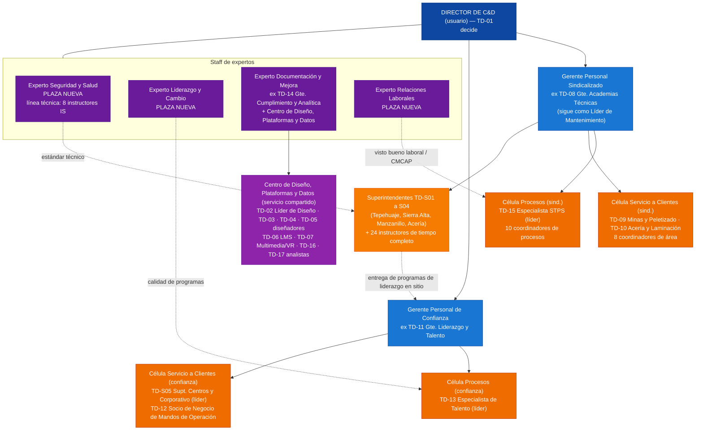

# Estructura Híbrida de Academia GASM (Decisión D-001, opción C)

> **Decisión del Director:** mantener la nueva estructura (4 expertos de staff + 2 gerencias por segmento, cada una con sus células de Procesos y de Servicio a Clientes Internos) y acomodar dentro de ella las plazas y el conocimiento del diseño anterior de 64 plazas (4 gerencias por especialidad).
> **Asignación:** el Director delegó en el equipo la propuesta de acomodo. Esta es la propuesta. El Director puede cambiar cualquier asignación, y los cambios se registran en `decisiones/registro-de-decisiones.md`.

## 1. Criterios de acomodo
1. **Cliente primero:** cada plaza va a la gerencia del segmento al que dedica la mayor parte de su trabajo (sindicalizado ≈ 72% de la plantilla, confianza ≈ 28%).
2. **Conocimiento con su dueño:** los 4 gerentes anteriores no se pierden; se convierten en los puestos nuevos más cercanos a lo que ya dominan, para conservar su conocimiento.
3. **Servicios compartidos en staff:** lo que usan las dos gerencias (diseño instruccional, LMS, VR, datos) queda con un experto de staff, no duplicado.
4. **Sin romper la operación:** los superintendentes, coordinadores e instructores siguen en sus sitios con sus carteras. Cambia a quién reportan y a qué célula pertenecen.

## 2. Organigrama híbrido (67 plazas)

**Reportes directos al Director:** 6 (4 expertos + 2 gerentes), frente a 9 en el diseño anterior.

## 3. Acomodo de las 64 plazas anteriores y las 3 nuevas

| Plaza anterior | Nuevo lugar en la estructura híbrida | Cambio |
|---|---|---|
| TD-01 Director | **Director** (usuario) | Sin cambio |
| TD-02 Gerente de Diseño Instruccional y Digital | **Líder del Centro de Diseño, Plataformas y Datos**, reporta al Experto Documentación y Mejora | Pasa de gerente a líder de servicio compartido |
| TD-03 Diseñador: Seguridad e Inducción | Centro de Diseño · punteado al **Experto Seguridad y Salud** | Línea funcional nueva |
| TD-04 Diseñador: Academias Técnicas | Centro de Diseño · punteado al **Gerente Sindicalizado** | Línea funcional nueva |
| TD-05 Diseñador: Liderazgo, Digital y Talento | Centro de Diseño · punteado al **Experto Liderazgo y Cambio** | Línea funcional nueva |
| TD-06 Especialista LMS | Centro de Diseño | Sin cambio de funciones |
| TD-07 Desarrollador Multimedia/VR | Centro de Diseño | Sin cambio de funciones |
| TD-08 Gerente de Academias Técnicas | **Gerente Personal Sindicalizado** (conserva la Academia de Mantenimiento y Confiabilidad) | Amplía su alcance a todo el segmento sindicalizado |
| TD-09 Líder Academia de Minería | **Célula de Servicio (sind.)**: socio de negocio de Minas y Peletizado | Añade el rol de servicio al cliente |
| TD-10 Líder Academia de Acería y Laminación | **Célula de Servicio (sind.)**: socio de negocio de Acería y Laminación | Añade el rol de servicio al cliente |
| TD-11 Gerente de Liderazgo y Talento | **Gerente Personal de Confianza** | Amplía su alcance a todo el segmento de confianza |
| TD-12 Especialista de Talento (Escuela de Supervisores, mentoring) | **Célula de Servicio (confianza)**: Socio de Negocio de Mandos de Operación | Pasa de administrar cohortes a atender a directores y superintendentes |
| TD-13 Especialista de Talento (sucesión, HiPo, graduados, becas) | **Líder de la Célula de Procesos (confianza)**; absorbe la administración de cohortes de liderazgo | Suma la administración de cohortes |
| TD-14 Gerente de Cumplimiento y Analítica | **Experto Documentación y Mejora** | Pasa de gerente a experto de staff con servicio compartido |
| TD-15 Especialista de Cumplimiento STPS | **Líder de la Célula de Procesos (sind.)**; da servicio de DC-3/DC-4 también al personal de confianza | Suma el liderazgo de la célula |
| TD-16 Analista (tableros, integraciones) | Centro de Diseño, Plataformas y Datos | Sin cambio |
| TD-17 Analista (N3/N4, ROI) | Centro de Diseño, Plataformas y Datos; hace los estudios ROI de ambas gerencias | Sin cambio |
| TD-S01 a TD-S04 Superintendentes (Tepehuaje, Sierra Alta, Manzanillo, Acería) | Reportan en línea sólida al **Gerente Sindicalizado**; punteada al Gerente de Confianza (entrega en sitio de liderazgo y talento) | Antes reportaban al Director |
| TD-S05 Superintendente de Centros y Corporativo | **Líder de la Célula de Servicio (confianza)**: socio de negocio de las áreas corporativas; conserva los centros de servicio con apoyo itinerante de Acería | Cambia de gerencia |
| 18 coordinadores | Siguen en su sitio, con línea sólida a su superintendente; pertenecen funcionalmente a una célula (ver §4) | Pertenencia a una célula |
| 24 instructores de tiempo completo | Siguen reportando a su superintendente. Línea técnica: IS → **Experto Seguridad y Salud**; IM → TD-09; IA → TD-10; IN → Gerente Sindicalizado | La línea técnica de IS cambia: antes iba a la VP de Seguridad |
| **Nueva** | **Experto Seguridad y Salud** | +1 plaza |
| **Nueva** | **Experto Liderazgo y Cambio** | +1 plaza |
| **Nueva** | **Experto Relaciones Laborales** (puede venir de Relaciones Laborales corporativas por transferencia, sin plaza nueva) | +1 plaza (o 0 si es transferencia) |
| **Total** | **67 plazas** (64 + 3) | |

## 4. Coordinadores de sitio por célula

| Célula | Coordinadores | Carteras |
|---|---|---|
| **Procesos (sind.)**, 10 | TD-C-TEP-01, TEP-02, TEP-04 · SAL-01, SAL-02, SAL-04 · MZO-01 · ACN-06, ACN-07, ACN-08 | Programación y logística, registros LMS y DC-3, CMCAP, contratistas REPSE, centro de formación y simuladores, aprendices |
| **Servicio a Clientes (sind.)**, 8 | TD-C-TEP-03 (Mina tajo) · SAL-03 (Subterránea) · MZO-02 (Peletizado y puerto) · ACN-01 (DRI) · ACN-02 (EAF y colada) · ACN-03 (Laminación tira / IATF) · ACN-04 (Laminación largos) · ACN-05 (Mantenimiento central) | Un coordinador por área cliente: certificación, OJT y plan de área con el superintendente de operación |
| **Servicio a Clientes (confianza)**, punteado | TEP-04 y ACN-08 (logística de la Escuela de Supervisores en sitio) | Apoyo en sitio a TD-12 y TD-S05 |

## 5. ¿Quién tiene el conocimiento de la estructura anterior? (custodios)

| Conocimiento del diseño anterior | Custodio principal | Co-custodios | Documentos que custodia |
|---|---|---|---|
| Estrategia, presupuesto, caso de negocio, propuesta al Consejo | **Director** | Ambos gerentes (presupuesto de su segmento) | `07-business-case/`, `09-proposal/`, `org/01` §4 (TD-01) |
| Diseño instruccional, LMS, VR, contenidos (TD-P04) | **Experto Documentación y Mejora** | TD-02 (líder operativo) | `org/01` §5–10, `04-processes` TD-P04 |
| Manual de procesos TD-P01 a TD-P12, control documental, política | **Experto Documentación y Mejora** | Experto Relaciones Laborales (política, aspectos laborales) | `04-processes/`, `03-department-design/training-and-development-policy.md`, `templates/` |
| KPIs, analítica, Kirkpatrick y ROI (TD-P06) | **Experto Documentación y Mejora** | TD-16, TD-17 | `08-kpis/`, `org/03` (TD-14, TD-16, TD-17) |
| Cumplimiento STPS, CMCAP, LFT (TD-P09, TD-P11) | **Experto Relaciones Laborales** (marco legal y relación con el sindicato) | TD-15 (operación de DC-3/DC-4/SIRCE) | `02-research/regulatory-framework-mexico.md`, `org/03` (TD-15) |
| Escuela de Seguridad, 16 Estándares de Riesgo Crítico, certificación (TD-P07), contratistas (TD-P08) | **Experto Seguridad y Salud** | TD-03 (diseño), instructores IS | `05-programs` §1, `04-processes` TD-P07/P08, `templates/critical-task-certification-checklist.md` |
| Academias técnicas, competencias (TD-P01), Legado Experto (TD-P10), instructores | **Gerente Sindicalizado** (ex TD-08) | TD-09, TD-10, TD-04 | `org/02`, `05-programs` §2–4, `templates/competency-matrix.csv` |
| Operación de sitios: DNC, plan DC-2, logística (TD-P02, P03, P05) | **Gerente Sindicalizado** | Superintendentes S01–S04, TD-15 | `org/04`, `templates/annual-training-plan.csv`, `templates/dnc-training-needs-questionnaire.md` |
| Liderazgo, talento, sucesión, pipeline | **Gerente Personal de Confianza** (ex TD-11) | TD-13, TD-12, Experto Liderazgo y Cambio (diseño de programas) | `org/03` (TD-11 a TD-13), `05-programs` §5 y §7 |
| Gestión del cambio y comunicación del modelo | **Experto Liderazgo y Cambio** | – | `06-implementation/` §3 |
| Centros de servicio y corporativo | **TD-S05** (Célula de Servicio, confianza) | Coordinador ACN-06 (contratistas) | `org/04` (TD-S05) |

**Regla de custodia:** el custodio responde por mantener vigente su conocimiento. Revisa sus documentos cada año o cuando cambie algo, contesta las consultas del resto del equipo y da visto bueno a cualquier cambio sobre ellos.

## 6. Impacto y transición

| Tema | Detalle |
|---|---|
| Plantilla | 64 → 67 plazas (+3 expertos). Si el Experto de Relaciones Laborales viene por transferencia, son 66 |
| Costo incremental | ≈ MXN 3.9 M/año [Supuesto: MXN 1.3 M costo total por experto senior]. En el año 1 se puede cubrir con la contingencia del presupuesto (MXN 6.6 M) |
| Contratación | Experto Relaciones Laborales (mes 0–2, crítico para la CMCAP); Experto Seguridad y Salud (mes 0–3, crítico para Cero Fatalidades); Experto Liderazgo y Cambio (mes 3–6) |
| Descripciones de puesto | Se actualizan las de TD-02, TD-08, TD-09, TD-10, TD-11, TD-12, TD-13, TD-14, TD-15 y TD-S05, y se crean las 3 nuevas (plazo: 30 días) |
| Comunicación | Anuncio del Director, reunión con cada célula y comunicado conjunto a las CMCAP (con visto bueno de Relaciones Laborales) |

**Plan de 30-60-90 días**
- **Día 30:** comunicar la estructura; cambiar las líneas de reporte en el HRIS; ronda de transferencia de conocimiento con cada custodio (una sesión de 2 h por tema de la tabla §5).
- **Día 60:** actualizar las descripciones de puesto; primera reunión mensual de seguimiento de objetivos con el formato común; contratar a los 2 expertos críticos.
- **Día 90:** revisar el funcionamiento de las células (carga de trabajo, encuesta a clientes internos) y ajustar.

## 7. Riesgos de la estructura híbrida

| Riesgo | Mitigación |
|---|---|
| El Gerente Sindicalizado queda con un tramo muy amplio (4 superintendentes + 2 líderes de academia + TD-15) | Los superintendentes tienen alta autonomía; TD-15 y TD-09/10 lideran sus células |
| El Experto Documentación y Mejora gestiona un equipo de 8 y deja de ser "solo experto" | Se reconoce explícitamente como experto con servicio compartido; TD-02 lleva la operación diaria |
| La Célula de Servicio de confianza es pequeña (2 personas + apoyo en sitio) | Revisión a los 90 días; opción de convertir un coordinador en socio de negocio |
| Los superintendentes pierden visibilidad directa con el Director | El Director mantiene una revisión operativa mensual con los superintendentes |

## 8. Decisiones pendientes del Director
Detectadas por el equipo en la revisión de los documentos del organigrama:

| ID | Tema | Recomendación del equipo |
|---|---|---|
| D-002 | Metas del manual de procesos más altas que las del año 1 del scorecard | Alinear el manual a la progresión del scorecard (año 1 → año 3) |
| D-003 | Plazas clave contratadas tarde para las metas del año 1 | Adelantar TD-05 (diseño de liderazgo) y TD-13 a la fase 1 |
| D-004 | La meta del año 1 de supervisores formados (40%) no se alcanza con 6 cohortes | Añadir una 7.ª cohorte o ajustar la meta a 37% |
| D-005 | No existe un proceso formal de talento y sucesión | Crear TD-P13 "Revisión de talento y sucesión" (custodio: Gerente de Confianza) |
| D-006 | CMCAP de los centros de servicio (Monterrey, Querétaro, Silao) | Pedir la opinión del Experto de Relaciones Laborales y de Jurídico |
| D-007 | Experto de Relaciones Laborales: plaza nueva o transferencia | Transferencia desde Relaciones Laborales corporativas si hay un candidato |
