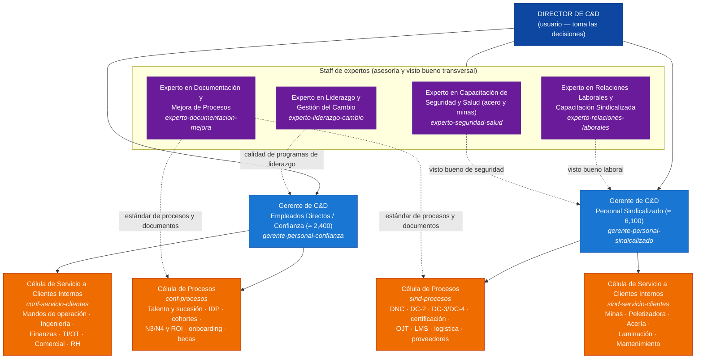
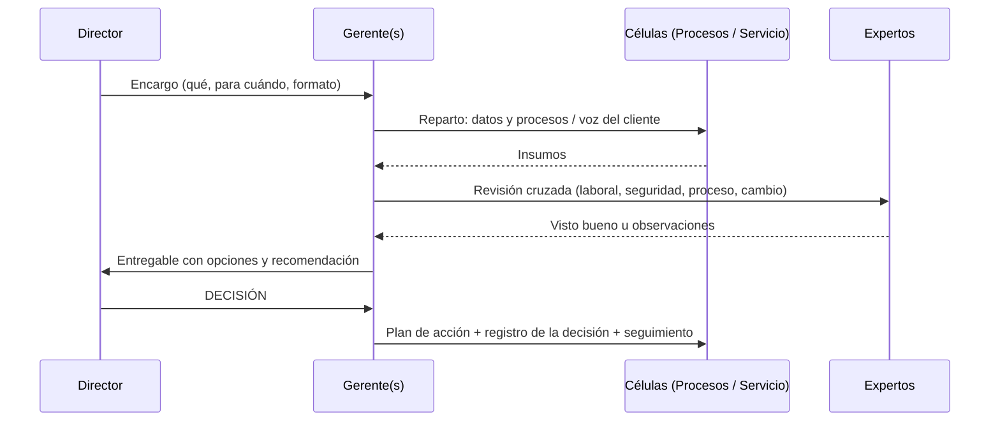

# Organigrama del Equipo del Director — Estructura v2

> Estructura pedida por el Director: **4 expertos de staff + 2 gerencias por segmento de personal** (sindicalizado y confianza), cada una con su equipo dividido en **Procesos** y **Servicio a Clientes Internos**. **El Director decide.** Cada rol tiene un subagente en `.claude/agents/`.

## 1. Roles y responsabilidades

| Rol | Responde por | Decide | Propone al Director |
|---|---|---|---|
| **Director (usuario)** | Estrategia, presupuesto, políticas, relación con la Dirección General y con el sindicato | **Todo lo que compromete recursos, políticas, acuerdos o comunicaciones externas** | – |
| **Experto Seguridad y Salud** | Calidad técnica de la capacitación en SST, riesgos críticos y NOMs | Visto bueno de seguridad (puede **bloquear** un entregable por riesgo) | Estándares, certificaciones, acciones tras incidentes |
| **Experto Liderazgo y Cambio** | Programas de liderazgo y planes de cambio | Visto bueno de calidad en liderazgo y cambio | Programas, planes de cambio y de comunicación |
| **Experto Documentación y Mejora** | Procesos TD-P, control documental, auditoría y mejora | Visto bueno de proceso | Procedimientos, A3, hallazgos de auditoría |
| **Experto Relaciones Laborales** | Cumplimiento de la LFT/CCT, CMCAP, relación con el sindicato en temas de capacitación | Visto bueno laboral (puede **bloquear** un entregable por riesgo legal) | Posiciones de negociación, actas, estrategias |
| **Gerente Sindicalizado** | Resultados de capacitación del personal sindicalizado | Asignación del trabajo en su equipo, prioridades operativas dentro del plan aprobado | Plan, presupuesto y cambios del segmento |
| **Gerente Confianza** | Resultados de desarrollo del personal de confianza | Asignación del trabajo en su equipo, prioridades dentro del plan aprobado | Plan, presupuesto y cambios del segmento |
| **Células de Procesos** | Que los procesos funcionen con evidencia y datos | Ejecución del proceso según el procedimiento | Mejoras de proceso (A3) |
| **Células de Servicio a Clientes** | Satisfacción y resultados de las áreas cliente | Clasificar y canalizar solicitudes | Soluciones a la medida para cada área |

## 2. Qué puede entregar cada rol

| Entregable | Expertos | Gerentes | Células de procesos | Células de servicio |
|---|---|---|---|---|
| Informe ejecutivo | ✔ técnico | ✔ del segmento | ✔ de cumplimiento y datos | ✔ por área cliente |
| Propuesta | ✔ | ✔ (consolida) | ✔ mejoras | ✔ soluciones a la medida |
| Presentación | ✔ | ✔ | ✔ | ✔ |
| Plan de acción | ✔ | ✔ | ✔ | ✔ |
| Plan de mejora A3 | ✔ (lidera Documentación) | ✔ | ✔ | ✔ |
| Seguimiento de objetivos | ✔ de su tema | ✔ consolidado | ✔ KPIs de proceso | ✔ KPIs por cliente |

## 3. Flujo típico de un encargo del Director

## 4. Relación con el diseño de 64 plazas (`03-department-design/org/`)

La estructura v2 reorganiza el departamento **por segmento de cliente** (sindicalizado / confianza) en lugar de por especialidad (4 gerencias). Esta es una propuesta de correspondencia, pendiente de tu decisión:

| Estructura v2 | Plazas del diseño de 64 que absorbe |
|---|---|
| Gerente Sindicalizado + células | TD-08 a TD-10 (Academias Técnicas), 24 instructores, superintendentes y coordinadores de sitio (operación), TD-15 |
| Gerente Confianza + células | TD-11 a TD-13 (Liderazgo y Talento), TD-16 y TD-17 (analítica) |
| Experto Seguridad y Salud | Línea técnica de los 8 instructores de Seguridad |
| Experto Liderazgo y Cambio | Rol de staff (nuevo) |
| Experto Documentación y Mejora | TD-02 a TD-07 (diseño instruccional, LMS, VR) y parte de TD-14 |
| Experto Relaciones Laborales | Rol de staff (nuevo); parte de TD-14 |

**Decisión requerida del Director:** (A) adoptar la estructura v2 como la estructura oficial y actualizar las descripciones de puesto de `03-department-design/org/`; (B) usar la v2 solo como equipo de dirección y mantener las 4 gerencias operativas; (C) un híbrido.
