# PRAXIA — Diseño del equipo de agentes v1.0

> PRAXIA · Documento interno · 9 de octubre de 2026 · Estado: **[PROPUESTA]**, pendiente de las decisiones D-P01 a D-P03 del Founder

## Mensaje clave

Los 28 roles del paquete quedan organizados en **8 equipos de entrega** y como **28 agentes operables** (`.claude/agents/praxia-*.md`). Cada agente tiene las reglas específicas de la skill que le aplican, y los 7 flujos del paquete quedan asignados paso por paso.

**Recomendación:** activar en **4 fases ligadas a hitos de negocio**, no al calendario. La Fase 1 empieza hoy con **8 agentes** enfocados en una sola meta: cerrar el primer diagnóstico pagado. Todo el RACI tiene al Founder como responsable final (A), así que la restricción real no es cuántos agentes hay sino cuántas horas de revisión tiene el Founder. Activar los 28 hoy produciría actividad sin pipeline: *Transformation Theater* interno.

---

## 1. Organigrama (líneas de reporte del paquete, `config/org_chart.json`) [DEFINIDO en el paquete]

```mermaid
graph TD
  F[Founder · decide]:::founder --> CEO[CEO-01 Chief of Staff]:::f1
  CEO --> STR[STR-01 Strategy]:::f2
  STR --> RES1[RES-01 Research]:::f2
  RES1 --> RES2[RES-02 Competitive Intel]:::f3
  CEO --> SAL1[SAL-01 CRO]:::f1
  SAL1 --> SAL2[SAL-02 Prospecting]:::f2
  SAL1 --> SAL3[SAL-03 Solutions & Proposal]:::f1
  CEO --> MKT1[MKT-01 CMBO]:::f2
  MKT1 --> MKT2[MKT-02 Thought Leadership]:::f1
  MKT1 --> MKT3[MKT-03 Growth]:::f3
  MKT1 --> DSN[DSN-01 Creative Director]:::f1
  CEO --> PR[PR-01 PR & Partnerships]:::f3
  CEO --> DEL1[DEL-01 Chief Delivery]:::f2
  DEL1 --> DEL2[DEL-02 Adoption & Change]:::f1
  DEL1 --> DEL3[DEL-03 AI Adoption]:::f3
  DEL1 --> CX[CX-01 Client Success]:::f2
  CEO --> DAT[DAT-01 Data & Impact]:::f2
  CEO --> DEV1[DEV-01 Product & Eng]:::f4
  DEV1 --> DEV2[DEV-02 Full-Stack]:::f4
  DEV1 --> DEV3[DEV-03 AI Systems]:::f4
  DEV1 --> UX[UX-01 UX Research]:::f4
  UX --> UI[UI-01 UI & Design Systems]:::f4
  CEO --> OPS[OPS-01 COO]:::f3
  OPS --> FIN[FIN-01 Finance]:::f2
  OPS --> HR[HR-01 People]:::f3
  OPS --> COM[COM-01 Internal Comms]:::f3
  CEO --> RISK[RISK-01 Legal & Risk]:::f1
  CEO --> QA[QA-01 Quality]:::f1
  classDef founder fill:#0C0D12,color:#F5F2EC,stroke:#0C0D12
  classDef f1 fill:#5B4BFF,color:#F5F2EC,stroke:#5B4BFF
  classDef f2 fill:#8B5CF6,color:#F5F2EC,stroke:#8B5CF6
  classDef f3 fill:#E9663C,color:#F5F2EC,stroke:#E9663C
  classDef f4 fill:#A7AAB5,color:#0C0D12,stroke:#A7AAB5
```

Colores por fase de activación propuesta: índigo = Fase 1 · violeta = Fase 2 · clay = Fase 3 · niebla = Fase 4.

## 2. Ocho equipos de entrega [PROPUESTA]

El organigrama dice a quién le reporta cada rol. Los equipos dicen **quién entrega qué**. Cada equipo tiene su carpeta en `praxia/equipos/` y ahí guarda sus entregables.

| Equipo | Integrantes | Dueño de | Carpeta |
|---|---|---|---|
| **E1 Dirección** | CEO-01, STR-01 | WF07 (síntesis), prioridades, decisiones | `equipos/E1-direccion/` |
| **E2 Revenue** | SAL-01, SAL-02, SAL-03 | **WF01** Lead to Contract | `equipos/E2-revenue/` |
| **E3 Marca y Demanda** | MKT-01, MKT-02, MKT-03, DSN-01, PR-01 | **WF03** Content to Demand | `equipos/E3-marca-demanda/` |
| **E4 Delivery y Adopción** | DEL-01, DEL-02, DEL-03, CX-01 | **WF02** Client Delivery, **WF05** Customer Support | `equipos/E4-delivery-adopcion/` |
| **E5 Research, Datos e IP** | RES-01, RES-02, DAT-01 | **WF06** Research to IP | `equipos/E5-research-datos-ip/` |
| **E6 Producto y Experiencia** | DEV-01, DEV-02, DEV-03, UX-01, UI-01 | **WF04** Product Build | `equipos/E6-producto-experiencia/` |
| **E7 Operaciones y Personas** | OPS-01, FIN-01, HR-01, COM-01 | **WF07** Internal Operations | `equipos/E7-operaciones-personas/` |
| **E8 Gobierno** | QA-01, RISK-01 | Puertas de calidad y riesgo en todos los flujos | `equipos/E8-gobierno/` |

Dos ajustes respecto al paquete. DAT-01 le reporta a CEO-01, pero trabaja en E5 porque su trabajo es medición e IP. PR-01 le reporta a CEO-01, pero trabaja en E3 porque su trabajo es construir autoridad y demanda.

## 3. Quién hace qué en cada flujo [DEFINIDO en el paquete]

| Flujo | Pasos en orden (dueño) | Aprobación final |
|---|---|---|
| WF01 Lead to Contract | SAL-02 → RES-02 → SAL-01 → SAL-03 → DEL-02 → FIN-01 → RISK-01 → QA-01 | Founder |
| WF02 Client Delivery | DEL-01 → RES-01 → DAT-01 → DEL-02 → DEL-03 → COM-01 → CX-01 → DAT-01 → QA-01 | Founder / cliente |
| WF03 Content to Demand | STR-01 → RES-01 → MKT-02 → DSN-01 → MKT-01 → QA-01 → *Founder publica* → MKT-03 | Founder |
| WF04 Product Build | DEV-01 → UX-01 → UI-01 → DEV-02 → DEV-03 → RISK-01 → QA-01 → *Founder* → CX-01 | Founder |
| WF05 Customer Support | CX-01 → DEL-01 / DEV-01 → RISK-01 → CX-01 → COM-01 | Cliente (cierre) |
| WF06 Research to IP | STR-01 → RES-01 → DAT-01 → RISK-01 → QA-01 → CEO-01 | Founder |
| WF07 Internal Operations | OPS-01 → FIN-01 → HR-01 → COM-01 → QA-01 → CEO-01 | Founder |

Cada agente tiene listados sus pasos en su propio archivo.

**Equivalencia con los roles de proyecto de la skill §10.1.** Los roles de la skill son funciones que en un proyecto real cubren el Founder o asociados humanos. Los agentes **preparan** el trabajo de esas funciones. Ningún agente sustituye a una persona frente al cliente.

| Rol de proyecto (skill §10.1) | Agente que lo prepara |
|---|---|
| Principal / Partner | Founder (CEO-01 lo asiste) |
| Engagement Lead | DEL-01 |
| Adoption Architect · Operating Model & Org Design Specialist | DEL-02 |
| People & Adoption Analyst | DAT-01 |
| AI Adoption Specialist · Capability & Learning Designer | DEL-03 |
| Change Comms & Brand | COM-01 (con el cliente) · DSN-01 (piezas) |
| Research & Insights | RES-01 / RES-02 |
| Revenue Ops / PMO | FIN-01 / OPS-01 |

## 4. Modelo de activación por fases [PROPUESTA]

Las fases avanzan cuando se cumple un **hito de negocio**, no cuando pasa el tiempo. Los plazos de la columna «Horizonte» vienen del roadmap de la skill §11.4.

| Fase | Se activa cuando | Agentes que entran | Total | Horizonte (skill §11.4) |
|---|---|---|---|---|
| **1 · Primer cliente** | Hoy | CEO-01, SAL-01, SAL-03, DEL-02, MKT-02, DSN-01, RISK-01, QA-01 | **8** | 0–60 días |
| **2 · Primer diagnóstico firmado** | Se firma el primer diagnóstico pagado (pasa G0) | DEL-01, DAT-01, CX-01, FIN-01, RES-01, STR-01, SAL-02, MKT-01 | 16 | 61–90 días |
| **3 · Repetibilidad** | Hay 2 diagnósticos entregados o se firma el primer programa o retainer | OPS-01, COM-01, HR-01, DEL-03, RES-02, MKT-03, PR-01 | 23 | 3–6 meses |
| **4 · Producto e IP** | El Founder aprueba el primer activo digital o el plan de validación del AGI | DEV-01, DEV-02, DEV-03, UX-01, UI-01 | 28 | 6–12 meses |

Por qué estos 8 en la Fase 1:

- **CEO-01** prioriza y lleva las decisiones.
- **SAL-01** define el ICP y la oferta ancla.
- **SAL-03** prepara el discovery y la propuesta.
- **DEL-02** diseña el diagnóstico que se va a vender. Sin un producto claro no hay venta.
- **MKT-02** construye la voz del Founder en LinkedIn, que es el canal prioritario.
- **DSN-01** produce el one-pager y el pitch con la marca.
- **RISK-01** valida el nombre y prepara el NDA.
- **QA-01** es la puerta que evita publicar datos inventados.

Ajuste respecto a lo que adelanté en el chat: había propuesto unos 6 agentes, con DEL-01 y MKT-01. Al mapear los flujos, quedaron 8. DEL-01 y MKT-01 gobiernan un portafolio de proyectos y campañas que todavía no existe. Los que producen hoy son DEL-02, MKT-02 y DSN-01.

## 5. Cobertura de los pasos sin dueño en la Fase 1

Con la opción A, algunos pasos de WF01, WF03 y WF07 tienen dueños que todavía no están activos. Así se cubren:

| Flujo · paso | Dueño en el paquete | En Fase 1 lo cubre |
|---|---|---|
| WF01 · 1 Investigación de cuenta e ICP | SAL-02 | SAL-01 |
| WF01 · 2 Verificación de industria y cuenta | RES-02 | SAL-01, con fuentes públicas |
| WF01 · 6 Costo, margen y precio | FIN-01 | SAL-03, con la skill §7.2 y §10.4, más revisión del Founder |
| WF03 · 1 Tema ligado al reto del comprador | STR-01 | CEO-01 |
| WF03 · 2 Evidencia y citas | RES-01 | MKT-02 cita fuentes y QA-01 las verifica |
| WF03 · 5 Revisión de mensaje y campaña | MKT-01 | QA-01 revisa marca y el Founder aprueba |
| WF03 · 8 Aprendizaje de alcance y conversaciones | MKT-03 | MKT-02, con registro manual de conversaciones originadas |
| WF07 · 1–4 Capacidad, finanzas, personas y comunicación | OPS-01, FIN-01, HR-01, COM-01 | CEO-01, en la revisión semanal de 30 minutos (skill §11.3) |

WF02, WF05 y WF06 arrancan en la Fase 2, cuando hay un cliente. WF04 arranca en la Fase 4.

## 6. Cómo se orquesta en Claude Code

En Claude Code, un subagente no puede lanzar otros subagentes. Por eso **la sesión principal hace de orquestador** y aplica las reglas de `SYSTEM_ORCHESTRATOR.md`. CEO-01 se queda con su trabajo de fondo: síntesis estratégica, OKRs y registro de decisiones.

1. El Founder hace un encargo.
2. La sesión principal le asigna un ID `PRX-NNNN`, arma el brief (formato `AGENT_TASK.json`) y elige el flujo.
3. Lanza a los agentes dueños de cada paso, en paralelo cuando los pasos son independientes y respetando el orden cuando hay dependencias. Si un rol no está activo, usa la cobertura de la §5.
4. Pasa el resultado por la puerta de **QA-01**, y también de **RISK-01** cuando hay claims, datos, contratos o temas legales.
5. Consolida **un solo entregable** en la carpeta del equipo dueño, con la sección «Decisión requerida del Founder».
6. El Founder decide y la decisión se anota en `registro-de-decisiones.md`.

### Backlog propuesto para la Fase 1 (skill §11.4, días 0–30)

| ID | Encargo | Dueño (equipo) | Colaboran | Depende de |
|---|---|---|---|---|
| PRX-0001 | Plan de 90 días, cadencia semanal y tablero mínimo | CEO-01 (E1) | SAL-01 | — |
| PRX-0002 | ICP del Horizonte 1 y oferta ancla (Adoption Gap Diagnostic): para quién, problema, valor, precio [PROPUESTA] | SAL-01 (E2) | CEO-01, DEL-02 | — |
| PRX-0003 | Kit de diagnóstico: instrumento 5 capas × 5 niveles, guías de entrevista, encuesta, plantilla de informe | DEL-02 (E4) | SAL-03 | PRX-0002 |
| PRX-0004 | Ficha de diagnóstico, guía de discovery y plantilla de calificación | SAL-03 (E2) | DEL-02 | PRX-0002 |
| PRX-0005 | One-page credentials y pitch deck de 8–12 láminas | DSN-01 (E3) | SAL-03, MKT-02 | PRX-0002, PRX-0004 |
| PRX-0006 | Calendario de LinkedIn de 4 semanas (12 piezas, serie The Adoption Gap) | MKT-02 (E3) | DSN-01 | — |
| PRX-0007 | Brief de validación del nombre (marca, dominio, redes) y NDA en borrador | RISK-01 (E8) | — | — |

QA-01 revisa todos estos entregables antes de que lleguen al Founder. PRX-0001, PRX-0002, PRX-0006 y PRX-0007 pueden arrancar en paralelo.

## 7. Inconsistencias en las fuentes y cómo se resuelven

| # | Inconsistencia | Resolución propuesta |
|---|---|---|
| 1 | `SERVICE_PORTFOLIO.md` nombra los servicios distinto que la skill y el Master. Por ejemplo, «Strategy Execution & Adoption» frente a «Strategy-to-Adoption Advisory». | Usar los nombres de la skill §5.1, que tiene precedencia (§0.1). Decisión D-P02. |
| 2 | El método de entrega aparece con 5 pasos (Discover…Measure & Scale) y con 4 etapas (SENSE, ALIGN, ADOPT, SUSTAIN). | Son compatibles. Ante el cliente se usan las 4 etapas de marca y los 5 pasos quedan como detalle operativo (skill §6.5). |
| 3 | El paquete pone a CEO-01 como orquestador. | En Claude Code orquesta la sesión principal (§6). CEO-01 conserva la síntesis y el registro de decisiones. |
| 4 | Los perfiles del paquete apuntan a `knowledge/...` como ruta relativa. | Los agentes operables usan las rutas reales del repositorio. |
| 5 | Los 28 perfiles del paquete comparten un texto genérico. | Cada agente operable se reforzó con sus secciones de la skill, sus reglas específicas y sus pasos en los flujos. El perfil original queda como fuente. |
| 6 | Los perfiles y el paquete están en inglés, y la skill pide narrativa interna en español. | Los agentes trabajan en español en lo interno, y en el idioma del cliente para lo externo. |
| 7 | El `CLAUDE.md` raíz describe el proyecto GASM. | Se agregó una nota en el `CLAUDE.md` raíz: lo que está en `praxia/` sigue `praxia/CLAUDE.md`. Los agentes praxia-* lo leen primero. |
| 8 | Faltan los logos oficiales en PNG y el PDF de Brand Guidelines. | [PENDIENTE] Mientras lleguen, se usa el SVG de referencia marcado «provisional». |

## 8. Riesgos

- **Cuello de botella del Founder.** Todo lo aprueba él. Para mitigarlo, QA-01 filtra antes y cada entregable abre con la decisión requerida.
- **Producir en lugar de vender.** Es el patrón «abstraer hacia arriba» que describe la skill §1. Para mitigarlo, el backlog de la Fase 1 está ligado al primer diagnóstico pagado y CEO-01 debe nombrar el patrón cuando aparezca.
- **Datos inventados en piezas comerciales.** Para mitigarlo, QA-01 puede bloquear y las cifras de los decks antiguos están marcadas para verificación.

---

## Decisión requerida del Founder

**D-P01 · Modelo de activación del equipo**

| Opción | Qué implica | Riesgo | Costo |
|---|---|---|---|
| **A · Por fases ligadas a hitos (recomendada)** | 8 agentes hoy y el resto según los hitos de la §4 | Algunos pasos quedan cubiertos por otro rol en la Fase 1 (§5) | El más bajo en horas de revisión del Founder |
| B · Por flujo | Activar completos WF01 y WF03 (unos 14 agentes) y luego los demás flujos | Más revisión sin cliente que la justifique | Medio |
| C · Los 28 desde hoy | Toda la organización disponible para cualquier encargo | Actividad sin pipeline (*Transformation Theater* interno) y saturación del Founder | Alto |

Recomendación: **A**. Es la única que pasa el filtro de la skill: primero el primer cliente y después la infraestructura (§8.1).

**D-P02 · Nombres de los servicios.** Recomendación: adoptar los de la skill §5.1 y corregir `SERVICE_PORTFOLIO.md` en la siguiente revisión del conocimiento.

**D-P03 · Backlog de la Fase 1.** Recomendación: aprobar PRX-0001 a PRX-0007 y arrancar hoy en paralelo PRX-0002 (ICP y oferta ancla), PRX-0006 (LinkedIn) y PRX-0007 (nombre y NDA).

**Fecha límite sugerida para decidir:** 16 de octubre de 2026 [PROPUESTA]. Cada semana sin decidir retrasa la meta de los primeros 30 días del roadmap.
